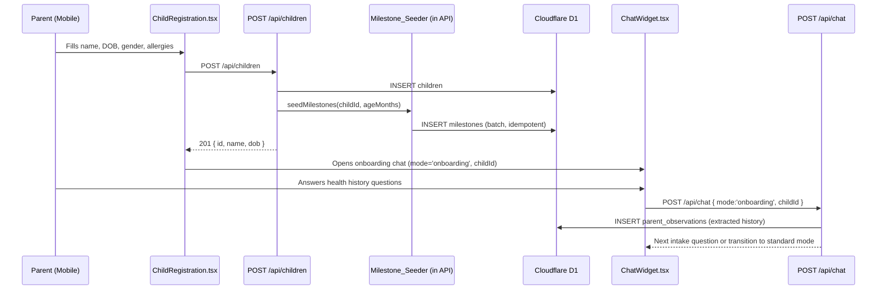

# Design Document: Child Health Journey

## Overview

This feature stitches together the existing SKIDS Parent building blocks — child registration, milestone tracking, Dr. SKIDS chat, and the observation journal — into a coherent, mobile-first health journey. The changes are surgical: no new infrastructure, no new pages, no new database tables. Every fix targets a specific file in the existing codebase.

The six work areas in priority order:
1. Fix the mobile chat widget visibility bug (CSS one-liner, highest impact)
2. Auto-seed milestones on child creation (server-side, one-time setup)
3. Add vaccination + growth context to the AI system prompt (richer AI responses)
4. Wire "Ask Dr. SKIDS" into the Observation Journal (closes the loop)
5. Add onboarding chat mode after child registration (guided history intake)
6. Fix the cramped mobile tab bar and add a Dr. SKIDS FAB on the dashboard

## Architecture

All changes are confined to existing files. The data flow after this feature:

```mermaid
flowchart LR
    OJ[ObservationJournal] -->|concern_level mild/moderate/serious| ADS[Ask Dr. SKIDS button]
    ADS -->|dispatches open-dr-skids event| CW[ChatWidget]
    CW -->|childId + pre-filled message| CA[POST /api/chat]
    CA -->|vaccinationHistory + latestGrowth| SP[buildSystemPrompt]
    SP -->|enriched context| AI[Workers AI]
```





## Components and Interfaces

### 1. `src/pages/api/children.ts` — Add `seedMilestones`

New internal function called at the end of the `POST` handler, after the child INSERT succeeds:

```typescript
async function seedMilestones(childId: string, ageMonths: number, db: any): Promise<void> {
  const milestones = getMilestonesForAge(ageMonths)
  for (const m of milestones) {
    await db.prepare(
      `INSERT OR IGNORE INTO milestones
         (id, child_id, milestone_key, title, category, status,
          expected_age_min, expected_age_max, created_at, updated_at)
       VALUES (?, ?, ?, ?, ?, 'not_started', ?, ?, datetime('now'), datetime('now'))`
    ).bind(
      crypto.randomUUID(), childId, m.key, m.title, m.category,
      m.expectedAgeMin, m.expectedAgeMax
    ).run()
  }
}
```

`INSERT OR IGNORE` handles the idempotency requirement (Req 1.3) — if a milestone with the same `(child_id, milestone_key)` unique constraint already exists, it is silently skipped. The call is wrapped in a `try/catch` so a seeding failure never blocks the `201` response (Req 1.4).

### 2. `src/components/chat/ChatWidget.tsx` — Mobile visibility + onboarding mode

Two changes:

**a) Fix floating button CSS** (Req 2.1):
```diff
- className="... hidden md:flex"
+ className="... flex"
```

**b) Accept `mode` prop and `onboardingMessage`**:
```typescript
interface ChatWidgetProps {
  fullScreen?: boolean
  token?: string
  childId?: string
  childName?: string
  children?: { id: string; name: string }[]
  mode?: 'standard' | 'onboarding'          // NEW
  initialMessage?: string                    // NEW — pre-fills first bot message
}
```

When `mode === 'onboarding'`, the widget sends `mode` in the chat API body and replaces `WELCOME_MESSAGE` with the onboarding opener.

### 3. `src/pages/api/chat.ts` — Onboarding mode + enriched context

**a) Accept `mode` in request body**:
```typescript
let body: { message: string; childId?: string; conversationId?: string; mode?: 'onboarding' | 'standard' }
```

**b) Load vaccination + growth data** (Req 5.1–5.2):
```typescript
// After existing milestone/observation queries:
let vaccinationHistory: string[] = []
let latestGrowth: { height?: number; weight?: number; date?: string } | undefined

if (body.childId && db) {
  try {
    const { results: vax } = await db.prepare(
      'SELECT vaccine_name, date_given FROM vaccination_records WHERE child_id = ? ORDER BY date_given DESC LIMIT 5'
    ).bind(body.childId).all()
    vaccinationHistory = (vax || []).map((v: any) => `${v.vaccine_name} on ${v.date_given}`)
  } catch {}

  try {
    const growth = await db.prepare(
      'SELECT height_cm, weight_kg, recorded_date FROM growth_records WHERE child_id = ? ORDER BY recorded_date DESC LIMIT 1'
    ).bind(body.childId).first() as any
    if (growth) latestGrowth = { height: growth.height_cm, weight: growth.weight_kg, date: growth.recorded_date }
  } catch {}
}
```

**c) Pass `mode` to `buildSystemPrompt`** so the onboarding prompt is used when appropriate.

### 4. `src/lib/ai/prompt.ts` — Extended `ChatContext` + onboarding prompt

```typescript
export interface ChatContext {
  childProfile?: ChildProfile
  relevantContent?: string
  recentObservations?: string[]
  achievedMilestones?: string[]
  vaccinationHistory?: string[]      // NEW
  latestGrowth?: {                   // NEW
    height?: number
    weight?: number
    date?: string
  }
  mode?: 'standard' | 'onboarding'  // NEW
}
```

New `ONBOARDING_PROMPT` constant used when `context.mode === 'onboarding'`:

```
You are Dr. SKIDS conducting a health history intake for a new child profile.
Ask the parent ONE question at a time, in this order:
1. Birth history — any complications during pregnancy or delivery?
2. Past illnesses — any significant illnesses, hospitalizations, or surgeries?
3. Allergies — any known food, medication, or environmental allergies?
4. Development — any concerns about speech, movement, behavior, or learning?

After each answer, acknowledge warmly, extract any health facts mentioned,
then ask the next question. When all 4 areas are covered, say:
"Thank you — I've noted all of this for [child name]'s health record.
You can now ask me anything about [child name]'s health and development."
```

### 5. `src/components/phr/ObservationJournal.tsx` — "Ask Dr. SKIDS" button

The component already receives `childId` and `token`. Add an `askDrSkids(text: string)` helper that dispatches the existing `open-dr-skids` custom event (already handled by `ChatWidget`):

```typescript
function askDrSkids(observationText: string) {
  window.dispatchEvent(new CustomEvent('open-dr-skids', {
    detail: { question: `I noticed: "${observationText}" — what should I do?` }
  }))
}
```

The button appears on each observation card where `concern_level !== 'none'` (Req 4.1), and on the empty state (Req 4.4).

### 6. `src/components/phr/ChildDashboard.tsx` — Mobile tab fix + Dr. SKIDS FAB

**a) Shorten tab labels on mobile** (Req 6.2):
```typescript
const TABS = [
  { key: 'milestones', label: 'Milestones', short: 'Miles', emoji: '🎯' },
  { key: 'habits',     label: 'Habits',     short: 'Habits', emoji: '✅' },
  { key: 'growth',     label: 'Growth',     short: 'Growth', emoji: '📏' },
  { key: 'notes',      label: 'Notes',      short: 'Notes',  emoji: '📝' },
  { key: 'records',    label: 'Records',    short: 'Rec.',   emoji: '📋' },
]
```

Tab renders `short` label on `<768px` via responsive class: `hidden sm:inline` / `sm:hidden`.

**b) Dr. SKIDS FAB** (Req 6.3–6.4):
A fixed button rendered inside the dashboard container, visible only on mobile (`md:hidden`), above the bottom safe area. Dispatches `open-dr-skids` with the current `childId` pre-selected.

### 7. `src/components/auth/ChildRegistration.tsx` — Trigger onboarding chat

The `onComplete` callback currently just closes the modal. Change it to accept the new child's ID and open the onboarding chat:

```typescript
interface Props {
  token: string
  onComplete: (childId: string) => void  // now passes childId
  onClose: () => void
}
```

The parent page (`/me`) receives `childId` and renders `ChatWidget` with `mode='onboarding'` and `childId` set.

## Data Models

No new tables. Uses existing schema:

| Table | Relevant columns used |
|---|---|
| `children` | `id`, `parent_id`, `name`, `dob`, `gender` |
| `milestones` | `id`, `child_id`, `milestone_key`, `title`, `category`, `status`, `expected_age_min`, `expected_age_max` |
| `parent_observations` | `id`, `child_id`, `observation_text`, `category`, `concern_level`, `date` |
| `vaccination_records` | `child_id`, `vaccine_name`, `date_given` |
| `growth_records` | `child_id`, `height_cm`, `weight_kg`, `recorded_date` |
| `chatbot_conversations` | `id`, `parent_id`, `child_id`, `messages_json` |

The `milestones` table must have a unique constraint on `(child_id, milestone_key)` for `INSERT OR IGNORE` to work. If this constraint doesn't exist in the current schema, the seeder will use `INSERT OR IGNORE` with a manual duplicate check as fallback.

## Error Handling

| Scenario | Behavior |
|---|---|
| Milestone seeding DB error | Log error server-side, return `201` for child creation (Req 1.4) |
| Chat API called without `childId` | Build prompt without child context, respond generically |
| Vaccination/growth query fails | Skip those fields in prompt, do not error |
| Onboarding chat — AI fails to extract structured data | Save raw observation text as-is, do not block conversation |
| `open-dr-skids` event fired but `ChatWidget` not mounted | Event is ignored silently (no global state dependency) |
| `INSERT OR IGNORE` on milestones — no unique constraint | Seeder catches duplicate key error per-row and continues |

## Testing Strategy

### Unit Tests

- `seedMilestones()`: given a known `ageMonths`, verify the correct milestone keys are inserted and that calling it twice does not duplicate records.
- `buildSystemPrompt()`: verify that when `vaccinationHistory` and `latestGrowth` are provided, the rendered string contains those values; verify onboarding mode uses the intake prompt.
- `askDrSkids()` helper: verify the dispatched `CustomEvent` has the correct `detail.question` format.

### Property-Based Tests

Property tests use a PBT library appropriate for TypeScript — **fast-check** (`npm i -D fast-check`). Each test runs a minimum of 100 iterations.

A property is a characteristic or behavior that should hold true across all valid executions of a system — essentially, a formal statement about what the system should do. Properties serve as the bridge between human-readable specifications and machine-verifiable correctness guarantees.


## Correctness Properties

Property 1: Milestone seeding completeness and field fidelity
*For any* child age in months, calling `seedMilestones(childId, ageMonths, db)` should produce exactly the same set of milestone keys as `getMilestonesForAge(ageMonths)`, and each inserted row's `title`, `category`, `expected_age_min`, and `expected_age_max` should exactly match the corresponding `MilestoneDefinition` from the content library.
**Validates: Requirements 1.1, 1.2**

Property 2: Milestone seeding idempotence
*For any* child and age, calling `seedMilestones` twice should produce the same number of milestone rows as calling it once — no duplicates are created on the second call.
**Validates: Requirements 1.3**

Property 3: Onboarding mode uses intake system prompt
*For any* chat request where `mode === 'onboarding'`, the system prompt passed to Workers AI should contain the history-intake questions (birth history, past illnesses, allergies, developmental concerns) and should NOT contain the standard welcome persona opener.
**Validates: Requirements 3.3**

Property 4: Onboarding chat saves observations
*For any* parent message sent during an onboarding chat session that contains health-relevant text, a `parent_observation` record with `category: 'Health'` should exist in the database for that child after the API call completes.
**Validates: Requirements 3.4**

Property 5: Skip onboarding when observations exist
*For any* child that already has one or more `parent_observations` records, the `ChildRegistration` completion flow should not set `mode='onboarding'` when opening the chat widget.
**Validates: Requirements 3.6**

Property 6: Ask Dr. SKIDS event contains observation text and childId
*For any* observation text and childId, calling `askDrSkids(observationText, childId)` should dispatch a `open-dr-skids` CustomEvent whose `detail.question` contains the observation text and whose `detail.childId` equals the provided childId.
**Validates: Requirements 4.1, 4.2, 4.3**

Property 7: buildSystemPrompt includes all provided context fields
*For any* `ChatContext` object that includes `vaccinationHistory` (non-empty array) and `latestGrowth` (with height and weight), the string returned by `buildSystemPrompt(context)` should contain each vaccination entry and the growth values.
**Validates: Requirements 5.1, 5.2, 5.4**

Property 8: Tab short labels are ≤6 characters
*For all* tab definitions in the `TABS` constant in `ChildDashboard.tsx`, the `short` label string should have a length of 6 characters or fewer.
**Validates: Requirements 6.2**

