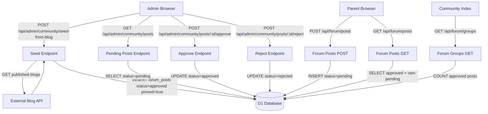

# Design Document: Community Seeding & Moderation

## Overview

This feature solves the cold-start problem for the SKIDS community by (1) seeding pinned discussion-starter posts from existing blog articles and (2) introducing a moderation queue so parent-submitted posts are reviewed before going live.

The implementation extends the existing `forum_posts` schema with four new columns, adds a set of admin API routes, updates the public forum API to respect post status and pinning, and provides a React-based admin moderation panel.

---

## Architecture



The system runs entirely on Cloudflare Workers + D1. No new infrastructure is required.

---

## Components and Interfaces

### New Files

| Path | Purpose |
|---|---|
| `migrations/0008_community_moderation.sql` | ALTER TABLE migration adding 4 columns |
| `src/pages/api/admin/community/seed-from-blog.ts` | POST — fetch blog API and seed posts |
| `src/pages/api/admin/community/posts/index.ts` | GET pending posts, POST admin-created post |
| `src/pages/api/admin/community/posts/[id]/approve.ts` | POST — approve a post |
| `src/pages/api/admin/community/posts/[id]/reject.ts` | POST — reject a post |
| `src/pages/admin/community.astro` | Admin moderation page |
| `src/components/admin/CommunityModerationPanel.tsx` | React panel for moderation UI |

### Modified Files

| Path | Change |
|---|---|
| `src/lib/db/schema.ts` | Add `status`, `pinned`, `source`, `blogSlug` to `forumPosts` |
| `src/pages/api/forum/posts.ts` | Filter by status, add pinned ordering, expose pending to author |
| `src/pages/api/forum/groups.ts` | Compute `post_count` from approved posts |

### Admin Auth Helper

All admin endpoints reuse the same `checkAuth` pattern already used across the codebase:

```typescript
function checkAuth(request: Request, env: Env): boolean {
  const adminKey = env.ADMIN_KEY
  if (!adminKey) return true
  const auth = request.headers.get('Authorization')
  return auth === `Bearer ${adminKey}` || auth === adminKey
}
```

### Blog API Contract

External endpoint: `GET https://9vhd0onw23.execute-api.ap-south-1.amazonaws.com/published-blogs`

Expected response shape:
```typescript
interface BlogArticle {
  blogId: string
  title: string
  content: string
  category: string
  tags: string[]
  thumbnail?: string
  author?: string
  createdAt: string
}
```

---

## Data Models

### Schema Extension

Four columns are added to `forum_posts` via migration `0008_community_moderation.sql`:

```sql
ALTER TABLE forum_posts ADD COLUMN status TEXT NOT NULL DEFAULT 'pending'
  CHECK(status IN ('pending', 'approved', 'rejected'));
ALTER TABLE forum_posts ADD COLUMN pinned INTEGER NOT NULL DEFAULT 0;
ALTER TABLE forum_posts ADD COLUMN source TEXT DEFAULT NULL
  CHECK(source IN ('blog', NULL));
ALTER TABLE forum_posts ADD COLUMN blog_slug TEXT DEFAULT NULL;

CREATE INDEX IF NOT EXISTS idx_forum_posts_status
  ON forum_posts(group_id, status, pinned, created_at);
```

> Note: SQLite does not support `ADD COLUMN IF NOT EXISTS`. The migration is safe to run once; re-running is guarded by the Drizzle migration journal.

### Updated Drizzle Schema (`forumPosts`)

```typescript
export const forumPosts = sqliteTable('forum_posts', {
  // ... existing columns ...
  status: text('status', { enum: ['pending', 'approved', 'rejected'] })
    .notNull().default('pending'),
  pinned: integer('pinned', { mode: 'boolean' }).notNull().default(false),
  source: text('source', { enum: ['blog'] }),          // null = parent post
  blogSlug: text('blog_slug'),
})
```

### Blog → Group Mapping

Keyword matching is applied to `category` (lowercased) and `tags` (lowercased, joined). First match wins.

| Priority | Keywords | Target Group ID |
|---|---|---|
| 1 | `nutrition`, `feeding`, `food`, `diet`, `breastfeed`, `formula`, `solids` | `topic-nutrition` |
| 2 | `sleep`, `bedtime`, `nap`, `night waking` | `topic-sleep` |
| 3 | `development`, `milestone`, `speech`, `motor`, `cognitive` | `topic-development` |
| 4 | `behavior`, `behaviour`, `tantrum`, `discipline`, `screen time`, `emotion` | `topic-behavior` |
| 5 | `health`, `illness`, `vaccine`, `fever`, `doctor`, `sick` | `topic-health` |
| 6 | `0-6`, `newborn`, `infant` | `age-0-6m` |
| 7 | `6-12`, `6 month`, `crawl` | `age-6-12m` |
| 8 | `toddler`, `1-2`, `1 year`, `2 year` | `age-1-2y` |
| 9 | `preschool`, `2-5`, `potty`, `3 year`, `4 year` | `age-2-5y` |
| 10 | `school`, `5+`, `5 year`, `learning` | `age-5plus` |
| fallback | (no match) | `topic-development` |

### API Response Shapes

**GET /api/forum/posts** — post object additions:
```typescript
{
  // existing fields...
  status: 'approved' | 'pending' | 'rejected'
  pinned: boolean
  source: 'blog' | null
  isPending?: true   // only present when status === 'pending'
  isRejected?: true  // only present when status === 'rejected'
}
```

**POST /api/admin/community/seed-from-blog** response:
```typescript
{ seeded: number, skipped: number, total: number }
```

---

## Correctness Properties

*A property is a characteristic or behavior that should hold true across all valid executions of a system — essentially, a formal statement about what the system should do. Properties serve as the bridge between human-readable specifications and machine-verifiable correctness guarantees.*


### Property 1: Blog-to-group mapping correctness

*For any* blog article with a given `category` and `tags`, the mapping function should return the single most relevant group ID, and that group ID should be one of the known forum group IDs.

**Validates: Requirements 2.2**

### Property 2: Seeded post field invariants

*For any* blog article that is seeded, the resulting forum post should have `status = 'approved'`, `pinned = true`, `source = 'blog'`, `authorName = 'SKIDS Team'`, and `blogSlug` equal to the article's `blogId`.

**Validates: Requirements 2.3**

### Property 3: Seeding idempotence

*For any* set of blog articles, running the seeder twice should produce the same number of posts as running it once — the second run should skip all articles that were already seeded.

**Validates: Requirements 2.4**

### Property 4: Seed response count invariant

*For any* seeding run, the response values must satisfy `seeded + skipped === total`.

**Validates: Requirements 2.6**

### Property 5: Parent post defaults to pending

*For any* valid post submission by an authenticated parent, the created post should have `status = 'pending'`.

**Validates: Requirements 3.1, 3.2**

### Property 6: Pending post does not increment group post_count

*For any* group, creating a pending post in that group should leave the group's `post_count` unchanged.

**Validates: Requirements 3.3**

### Property 7: Unauthenticated GET returns only approved posts

*For any* database state containing posts with mixed statuses, an unauthenticated call to `GET /api/forum/posts` should return only posts with `status = 'approved'`.

**Validates: Requirements 4.1, 4.5**

### Property 8: Authenticated GET returns approved posts plus own pending and rejected posts

*For any* authenticated parent and any database state, `GET /api/forum/posts` should return all approved posts plus any pending or rejected posts where `parent_id` matches the authenticated parent's ID — and no other non-approved posts.

**Validates: Requirements 4.2, 7.1**

### Property 9: Post ordering invariant

*For any* list of posts returned by `GET /api/forum/posts`, all pinned posts should appear before all non-pinned posts; pinned posts should be ordered by `created_at` ascending; non-pinned approved posts should be ordered by `created_at` descending.

**Validates: Requirements 4.4, 10.1, 10.2, 10.3**

### Property 10: Approve sets status and increments post_count by exactly 1

*For any* pending post, calling the approve endpoint should set `status = 'approved'` and increment the associated group's `post_count` by exactly 1.

**Validates: Requirements 6.1, 8.2**

### Property 11: Reject sets status and decrements post_count (floor 0)

*For any* approved post, calling the reject endpoint should set `status = 'rejected'` and decrement the associated group's `post_count` by 1, with a floor of 0.

**Validates: Requirements 6.2, 8.3**

### Property 12: Admin-created post is immediately approved

*For any* post created via `POST /api/admin/community/posts` with a valid `ADMIN_KEY`, the post should have `status = 'approved'` and the group's `post_count` should be incremented by 1.

**Validates: Requirements 5.6, 11.1**

### Property 13: Reactions blocked on non-approved posts

*For any* forum post with `status != 'approved'`, attempting to submit a reaction should return HTTP 403.

**Validates: Requirements 9.2, 9.3**

### Property 14: Forum groups post_count reflects only approved posts

*For any* database state, the `post_count` returned by `GET /api/forum/groups` for each group should equal the count of posts in that group with `status = 'approved'`.

**Validates: Requirements 8.1**

### Property 15: Status flags on posts returned to author

*For any* pending post returned to its author, the response object should include `isPending: true`. *For any* rejected post returned to its author, the response object should include `isRejected: true`.

**Validates: Requirements 4.3, 7.2**

---

## Error Handling

| Scenario | Response |
|---|---|
| Blog API unreachable or non-200 | HTTP 502 `{ error: 'Blog API unavailable: <status>' }` |
| Missing or invalid ADMIN_KEY on any admin route | HTTP 401 `{ error: 'Unauthorized' }` |
| Post ID not found on approve/reject | HTTP 404 `{ error: 'Post not found' }` |
| Parent not authenticated on POST /api/forum/posts | HTTP 401 `{ error: 'Unauthorized' }` |
| Reaction on non-approved post | HTTP 403 `{ error: 'Reactions are only allowed on approved posts' }` |
| Missing required fields (groupId, title, content) | HTTP 400 `{ error: '<field> is required' }` |
| Blog API returns malformed JSON | HTTP 502 `{ error: 'Blog API returned invalid response' }` |

All errors are returned as `application/json`. Admin endpoints log errors to `console.error` for Cloudflare Workers tail log visibility.

---

## Testing Strategy

### Dual Testing Approach

Both unit tests and property-based tests are required. They are complementary:
- Unit tests cover specific examples, integration points, and error conditions
- Property tests verify universal invariants across randomly generated inputs

### Property-Based Testing Library

**Library**: `fast-check` (TypeScript-native, works in Vitest)

Install: `npm install --save-dev fast-check`

Each property test runs a minimum of **100 iterations** (fast-check default is 100; set `numRuns: 100` explicitly).

Each test is tagged with a comment in the format:
`// Feature: community-seeding-moderation, Property <N>: <property_text>`

### Property Tests (one test per property)

| Property | Test file | fast-check arbitraries |
|---|---|---|
| P1: Blog-to-group mapping | `__tests__/community/mapBlogToGroup.test.ts` | `fc.record({ category: fc.string(), tags: fc.array(fc.string()) })` |
| P2: Seeded post field invariants | `__tests__/community/seedPost.test.ts` | `fc.record({ blogId: fc.uuid(), title: fc.string(), ... })` |
| P3: Seeding idempotence | `__tests__/community/seedIdempotent.test.ts` | `fc.array(fc.record({ blogId: fc.uuid(), ... }))` |
| P4: Seed count invariant | `__tests__/community/seedCount.test.ts` | `fc.array(fc.record({ blogId: fc.uuid(), ... }))` |
| P5: Parent post defaults to pending | `__tests__/community/postStatus.test.ts` | `fc.record({ title: fc.string(1, 200), content: fc.string(1, 5000) })` |
| P6: Pending post_count unchanged | `__tests__/community/postCount.test.ts` | `fc.integer({ min: 0, max: 1000 })` (initial count) |
| P7: Unauthenticated GET approved only | `__tests__/community/postVisibility.test.ts` | `fc.array(fc.record({ status: fc.constantFrom('pending','approved','rejected') }))` |
| P8: Authenticated GET own posts | `__tests__/community/postVisibility.test.ts` | Same as P7 + `fc.uuid()` for parentId |
| P9: Post ordering | `__tests__/community/postOrdering.test.ts` | `fc.array(fc.record({ pinned: fc.boolean(), createdAt: fc.date() }))` |
| P10: Approve increments count | `__tests__/community/moderation.test.ts` | `fc.integer({ min: 0, max: 1000 })` (initial count) |
| P11: Reject decrements count | `__tests__/community/moderation.test.ts` | `fc.integer({ min: 0, max: 1000 })` |
| P12: Admin post approved immediately | `__tests__/community/adminPost.test.ts` | `fc.record({ title: fc.string(1, 200), content: fc.string(1, 5000) })` |
| P13: Reactions blocked on non-approved | `__tests__/community/reactions.test.ts` | `fc.constantFrom('pending', 'rejected')` |
| P14: Groups post_count approved only | `__tests__/community/groupCount.test.ts` | `fc.array(fc.record({ status: fc.constantFrom(...) }))` |
| P15: Status flags on author posts | `__tests__/community/postFlags.test.ts` | `fc.constantFrom('pending', 'rejected')` |

### Unit Tests (specific examples and error conditions)

- Schema defaults: insert post without status/pinned/source/blogSlug, verify defaults (Req 1.1–1.4)
- Seeder HTTP 502 on Blog API failure (Req 2.5)
- Seeder HTTP 401 without ADMIN_KEY (Req 2.7)
- POST /api/forum/posts returns HTTP 401 when unauthenticated (Req 3.5)
- CreatePostForm renders "awaiting review" confirmation message (Req 3.4)
- Approve/reject endpoints return HTTP 401 without ADMIN_KEY (Req 6.3)
- Approve/reject endpoints return HTTP 404 for unknown post ID (Req 6.4)
- Moderation panel renders empty state when no pending posts (Req 5.5)
- Moderation panel renders pending post list with required fields (Req 5.2)
- UI renders "Your post was not approved" label for rejected posts (Req 7.3)
- Admin panel accessible at /admin/community (Req 5.1)
