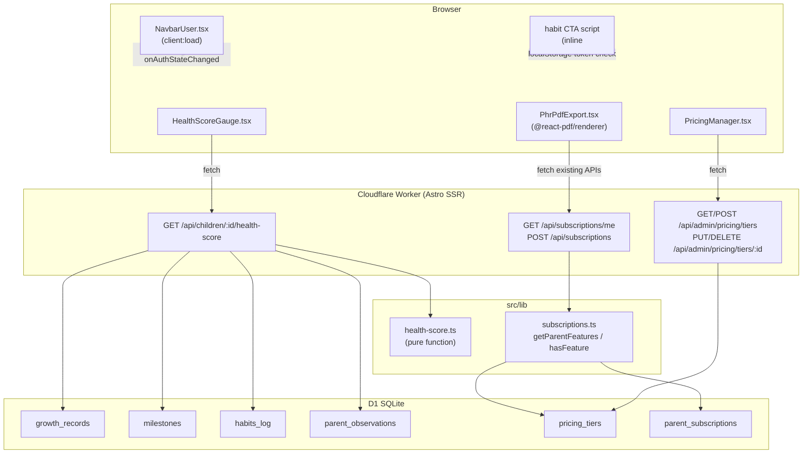

# Design Document: growth-monetisation

## Overview

This feature adds four capabilities to the SKIDS parent app:

1. **Public Content Navigation** — Fix unauthenticated browsing so habit/blog/discover pages never redirect to login; make the "Track this habit" CTA auth-aware client-side.
2. **Child Health Score Engine** — A composite 0–100 score computed from growth, development, habits, and nutrition data, displayed as a visual gauge on the child dashboard.
3. **PDF Export** — Client-side PDF generation via `@react-pdf/renderer`, gated behind the `pdf_export` feature key.
4. **Admin-Controlled Tiered Pricing** — Replace the static `care_plans` table with a fully admin-managed `pricing_tiers` + `parent_subscriptions` system with feature-flag gating.

The stack is Astro 5 + React + Cloudflare Workers + D1 SQLite + Drizzle ORM + Firebase Auth. All server code runs in the Workers runtime (no Node.js-only APIs). Tests use Vitest + fast-check.

---

## Architecture



### Key Design Decisions

- **Health score is server-computed**: The engine runs in the Worker, not the browser, so it can query D1 directly without exposing raw PHR data to the client.
- **PDF is browser-only**: `@react-pdf/renderer` runs entirely in the browser. The component fetches data from existing API endpoints and generates the PDF client-side, keeping the Worker runtime free of Node.js dependencies.
- **Snapshot immutability via INSERT-only**: New subscriptions always INSERT a new row with a snapshot of the tier's current `features_json`. Existing active subscriptions are never mutated when a tier changes.
- **Navbar requires no changes**: `NavbarUser.tsx` already handles the unauthenticated state by rendering a "Sign In" link. The Navbar itself never redirects. The only fix needed is the habit page CTA.

---

## Components and Interfaces

### 1. Public Content Navigation

**`src/components/common/Navbar.astro`** — No changes required. `NavbarUser.tsx` already renders "Sign In" for unauthenticated users via `useAuth()` / Firebase `onAuthStateChanged`.

**`src/pages/habits/[habit].astro`** — Add an inline `<script>` that intercepts the CTA anchor click, checks for a Firebase auth token in `localStorage` (key: `firebase:authUser:<projectId>:[DEFAULT]`), and redirects to `/login?redirect=/me` if absent. The anchor's `href` is changed to `#` and the script handles navigation.

```
ctaAuthCheck(localStorage) → '/me' | '/login?redirect=/me'
```

### 2. Health Score Engine

**`src/lib/phr/health-score.ts`** — Pure function module, no I/O.

```typescript
interface GrowthInput   { waz: number; haz: number }          // WHO z-scores
interface DevelopmentInput { achieved: number; eligible: number }
interface HabitsInput   { streaks: Record<HabitCategory, number> }
interface NutritionInput { concernLevel: 'none'|'mild'|'moderate'|'serious' }

interface HealthScoreInputs {
  growth?:      GrowthInput
  development?: DevelopmentInput
  habits?:      HabitsInput
  nutrition?:   NutritionInput
}

interface HealthScoreResult {
  score:      number   // integer [0, 100]
  trend:      'up' | 'down' | 'flat'
  components: {
    growth?:      number
    development?: number
    habits?:      number
    nutrition?:   number
  }
}

function computeHealthScore(inputs: HealthScoreInputs): number
function computeTrend(current: number, previous: number): 'up' | 'down' | 'flat'
function getScoreColor(score: number): 'red' | 'amber' | 'green'
```

Component scoring:
- **Growth**: average of `clamp(zscoreToScore(waz), 0, 100)` and `clamp(zscoreToScore(haz), 0, 100)` where `zscoreToScore(z) = (z + 3) / 6 * 100` (maps [-3, +3] → [0, 100])
- **Development**: `achieved / eligible * 100` (0 if eligible = 0)
- **Habits**: `mean(streaks) / 30 * 100`, capped at 100
- **Nutrition**: `none→100, mild→70, moderate→40, serious→10`
- **Weight redistribution**: base weights `{ growth: 0.30, development: 0.30, habits: 0.25, nutrition: 0.15 }`; absent components have their weight redistributed proportionally among present components
- **Trend**: `|current - previous| > 2` → up/down; otherwise flat

**`src/pages/api/children/[childId]/health-score.ts`** — Worker API route.

```
GET /api/children/:childId/health-score
Authorization: Bearer <firebase-token>
→ 200 { score, trend, components }
→ 401 if unauthenticated
→ 403 if child doesn't belong to parent
```

Fetches most recent growth record, milestone counts, latest habit streaks per category, and most recent nutrition observation from D1, then calls `computeHealthScore`.

### 3. HealthScoreGauge Component

**`src/components/phr/HealthScoreGauge.tsx`**

```typescript
interface Props {
  childId: string
  token: string
}
```

- SVG ring gauge: `stroke-dasharray` / `stroke-dashoffset` technique, radius 40, stroke-width 8
- Color: `getScoreColor(score)` → Tailwind stroke color class
- Trend arrow: ↑ (green), ↓ (red), → (gray)
- Skeleton: animated pulse div while loading
- Fetches from `/api/children/:childId/health-score`

Integrated into `ChildDashboard.tsx` child header section, rendered when `token` is available.

### 4. PDF Export

**`src/components/phr/PhrPdfExport.tsx`**

```typescript
interface Props {
  child: { id: string; name: string; dob: string; gender?: string }
  token: string
  features: string[]   // from subscription snapshot
}
```

Flow:
1. Check `features.includes('pdf_export')` — render button only if true
2. On click: set `loading = true`, disable button
3. Fetch in parallel: `/api/vaccinations?childId=`, `/api/growth?childId=`, `/api/milestones?childId=`, `/api/observations?childId=`
4. Build `@react-pdf/renderer` `<Document>` with 5 sections: header + 4 data sections
5. Call `pdf.save(filename)` where `filename = skids-${childName}-${YYYY-MM-DD}.pdf`
6. On error: set `error` state, display message, re-enable button

PDF structure:
```
Header: child name, DOB, gender, export date
Section 1: Vaccinations (table: vaccine, dose, date, provider)
Section 2: Growth Records (table: date, height, weight, BMI)
Section 3: Milestones (table: category, title, status, observed date)
Section 4: Recent Observations (last 10, table: date, category, text, concern level)
Each section shows "No records available" if empty.
```

### 5. Tiered Pricing

**`src/lib/subscriptions.ts`**

```typescript
async function getParentFeatures(parentId: string, db: D1Database): Promise<string[]>
async function hasFeature(parentId: string, feature: string, db: D1Database): Promise<boolean>
```

`getParentFeatures` queries `parent_subscriptions` for the most recent active row, parses `features_snapshot_json`. Falls back to free tier features `['pdf_export', 'health_score_basic']` if no active subscription found.

**Admin API routes** (`src/pages/api/admin/pricing/`):
- `tiers.ts` — `GET` list all, `POST` create
- `tiers/[id].ts` — `PUT` update, `DELETE` deactivate (rejects free tier)

All admin routes check `Authorization: Bearer ${ADMIN_KEY}`.

**Parent subscription API**:
- `src/pages/api/subscriptions/me.ts` — `GET` active subscription + features
- `src/pages/api/subscriptions/index.ts` — `POST` create new subscription row

**`src/components/admin/PricingManager.tsx`** — React component with:
- Tier list table (name, monthly price, yearly price, status, features)
- "New Tier" / "Edit" modal with TierForm
- Feature checklist for known keys: `pdf_export`, `health_score_basic`, `health_score_detailed`, `unlimited_children`, `priority_support`, `teleconsult_discount_pct`
- Inline error display for 400 responses

**`src/pages/admin/pricing.astro`** — Admin page mounting `PricingManager` with `client:load`.

---

## Data Models

### New DB Tables (added to `src/lib/db/schema.ts`)

```typescript
export const pricingTiers = sqliteTable('pricing_tiers', {
  id:                 text('id').primaryKey().$defaultFn(() => crypto.randomUUID()),
  name:               text('name').notNull(),
  description:        text('description'),
  currency:           text('currency').default('INR'),
  amountCents:        integer('amount_cents').notNull().default(0),
  amountYearlyCents:  integer('amount_yearly_cents').notNull().default(0),
  featuresJson:       text('features_json').notNull().default('[]'),
  isActive:           integer('is_active', { mode: 'boolean' }).default(true),
  createdAt:          text('created_at').default(sql`(datetime('now'))`),
})

export const parentSubscriptions = sqliteTable('parent_subscriptions', {
  id:                   text('id').primaryKey().$defaultFn(() => crypto.randomUUID()),
  parentId:             text('parent_id').notNull().references(() => parents.id),
  tierId:               text('tier_id').notNull().references(() => pricingTiers.id),
  status:               text('status', { enum: ['active', 'expired', 'cancelled'] }).default('active'),
  startedAt:            text('started_at').default(sql`(datetime('now'))`),
  expiresAt:            text('expires_at'),
  paymentId:            text('payment_id'),
  billingCycle:         text('billing_cycle', { enum: ['monthly', 'yearly'] }).default('monthly'),
  featuresSnapshotJson: text('features_snapshot_json').notNull().default('[]'),
  createdAt:            text('created_at').default(sql`(datetime('now'))`),
})
```

### Migration `migrations/0007_pricing_tiers.sql`

```sql
CREATE TABLE IF NOT EXISTS pricing_tiers (
  id TEXT PRIMARY KEY,
  name TEXT NOT NULL,
  description TEXT,
  currency TEXT NOT NULL DEFAULT 'INR',
  amount_cents INTEGER NOT NULL DEFAULT 0,
  amount_yearly_cents INTEGER NOT NULL DEFAULT 0,
  features_json TEXT NOT NULL DEFAULT '[]',
  is_active INTEGER NOT NULL DEFAULT 1,
  created_at TEXT DEFAULT (datetime('now'))
);

CREATE TABLE IF NOT EXISTS parent_subscriptions (
  id TEXT PRIMARY KEY,
  parent_id TEXT NOT NULL REFERENCES parents(id),
  tier_id TEXT NOT NULL REFERENCES pricing_tiers(id),
  status TEXT NOT NULL DEFAULT 'active' CHECK(status IN ('active','expired','cancelled')),
  started_at TEXT DEFAULT (datetime('now')),
  expires_at TEXT,
  payment_id TEXT,
  billing_cycle TEXT NOT NULL DEFAULT 'monthly' CHECK(billing_cycle IN ('monthly','yearly')),
  features_snapshot_json TEXT NOT NULL DEFAULT '[]',
  created_at TEXT DEFAULT (datetime('now'))
);

-- Seed free tier
INSERT INTO pricing_tiers (id, name, description, currency, amount_cents, amount_yearly_cents, features_json, is_active)
VALUES (
  'free',
  'Free',
  'Basic access',
  'INR',
  0,
  0,
  '["pdf_export","health_score_basic"]',
  1
);
```

### Existing Tables Used (read-only for health score)

| Table | Fields read |
|---|---|
| `growth_records` | `who_zscore_json`, `date` (most recent) |
| `milestones` | `status`, `expected_age_max` |
| `habits_log` | `habit_type`, `streak_days` (most recent per category) |
| `parent_observations` | `concern_level`, `category`, `date` (most recent nutrition) |

---

## Correctness Properties

*A property is a characteristic or behavior that should hold true across all valid executions of a system — essentially, a formal statement about what the system should do. Properties serve as the bridge between human-readable specifications and machine-verifiable correctness guarantees.*

### Property 1: Health Score Bounds

*For any* valid combination of growth, development, habits, and nutrition inputs — including partial inputs where one or more components are absent — `computeHealthScore` SHALL return an integer in the range [0, 100] inclusive.

**Validates: Requirements 3.2, 3.3, 3.9, 13.1**

### Property 2: Weight Invariant

*For any* input where all four components (growth, development, habits, nutrition) have data, the effective weights applied by `computeHealthScore` SHALL sum to exactly 1.0 (100%).

**Validates: Requirements 3.1, 3.4, 13.2**

### Property 3: Health Score Color Coding

*For any* integer score in [0, 100], `getScoreColor(score)` SHALL return `'red'` when score < 40, `'amber'` when 40 ≤ score ≤ 69, and `'green'` when score ≥ 70. No score in [0, 100] shall produce an undefined result.

**Validates: Requirements 4.2, 4.3, 4.4**

### Property 4: Trend Computation

*For any* two scores `current` and `previous` in [0, 100], `computeTrend(current, previous)` SHALL return `'up'` when `current - previous > 2`, `'down'` when `previous - current > 2`, and `'flat'` when `|current - previous| ≤ 2`.

**Validates: Requirements 4.5, 4.6, 4.7, 4.8**

### Property 5: PDF Data Completeness

*For any* child with N vaccination records, M growth records, K milestones, and P observations, the PDF document built by `PhrPdfExport` SHALL include all N vaccinations, all M growth records, all K milestones, and the min(P, 10) most recent observations ordered by date descending. Each section SHALL be present even when its count is zero.

**Validates: Requirements 5.1, 5.2, 5.3, 5.4, 5.5, 13.3**

### Property 6: PDF Filename Format

*For any* child name string and export date, the generated filename SHALL match the pattern `skids-{sanitised-child-name}-{YYYY-MM-DD}.pdf`.

**Validates: Requirements 6.4**

### Property 7: Feature Gating — Access Granted

*For any* parent whose active `features_snapshot_json` contains a given feature key, `hasFeature(parentId, key, db)` SHALL return `true`.

**Validates: Requirements 7.2, 10.1**

### Property 8: Feature Gating — Access Denied

*For any* parent whose active `features_snapshot_json` does NOT contain a given feature key, `hasFeature(parentId, key, db)` SHALL return `false`, and any API route guarded by that key SHALL return a 403 response with body `{ "error": "feature_not_available", "feature": "<key>" }`.

**Validates: Requirements 10.2, 10.4**

### Property 9: Free Tier Fallback

*For any* parent with no active `parent_subscriptions` row, `getParentFeatures(parentId, db)` SHALL return the free tier feature list `["pdf_export", "health_score_basic"]`.

**Validates: Requirements 10.3**

### Property 10: Free Tier Protection

*For any* admin request to deactivate or delete the pricing tier with `amount_cents = 0`, the Admin API SHALL return a 400 response with message `"Free tier cannot be deactivated"`, leaving the free tier row unchanged.

**Validates: Requirements 9.5, 13.5**

### Property 11: Subscription Status Transition DAG

*For any* `parent_subscriptions` row, the only valid in-place status mutations are `active → expired` and `active → cancelled`. Any attempt to set status to `active` on an existing `expired` or `cancelled` row (without inserting a new row with a valid `payment_id`) SHALL be rejected with a 400 error. New subscriptions are always created as new rows.

**Validates: Requirements 11.1, 11.2, 11.3, 11.4, 11.5, 13.6**

### Property 12: Snapshot Immutability

*For any* admin update to `pricing_tiers.features_json`, the `features_snapshot_json` of all existing `parent_subscriptions` rows with `status = 'active'` SHALL remain unchanged after the update.

**Validates: Requirements 12.1, 12.2, 13.4**

### Property 13: CTA Auth-Check Routing

*For any* invocation of the habit page CTA handler, if a valid Firebase auth token is present in `localStorage` then the handler SHALL navigate to `/me`; if no token is present (or the token is absent/expired) then the handler SHALL navigate to `/login?redirect=/me`.

**Validates: Requirements 2.1, 2.2, 2.3**

### Property 14: Features JSON Serialization Round-Trip

*For any* array of feature key strings, serializing to JSON and deserializing SHALL produce an array equal to the original.

**Validates: Requirements 8.3**

---

## Error Handling

| Scenario | Behaviour |
|---|---|
| Health score API — child not owned by parent | 403 Forbidden |
| Health score API — no data for any component | Return `{ score: 0, trend: 'flat', components: {} }` |
| PDF export — fetch failure on any section | Show error banner, re-enable button; partial data is not used |
| PDF export — `@react-pdf/renderer` throws | Catch, set error state, display message |
| Admin API — missing/invalid ADMIN_KEY | 401 Unauthorized |
| Admin API — deactivate free tier | 400 `"Free tier cannot be deactivated"` |
| Subscription API — invalid status transition | 400 `"Reactivation requires a new payment"` |
| `getParentFeatures` — DB error | Log error, return free tier features as safe fallback |
| Habit CTA — auth state indeterminate after 2s | Treat as unauthenticated, redirect to `/login?redirect=/me` |

---

## Testing Strategy

### Dual Testing Approach

Both unit tests and property-based tests are required. Unit tests cover specific examples, integration points, and error conditions. Property tests verify universal correctness across randomised inputs.

### Property-Based Testing

Library: **fast-check** (already in `package.json`).

Each property test runs a minimum of **100 iterations** (fast-check default). Each test is tagged with a comment referencing the design property:

```
// Feature: growth-monetisation, Property N: <property text>
```

Each correctness property above is implemented by exactly one property-based test.

**`src/lib/phr/health-score.test.ts`**

| Test | Property | fast-check arbitraries |
|---|---|---|
| Score always in [0, 100] | P1 | `fc.record` with optional growth/dev/habits/nutrition fields |
| Weights sum to 1.0 when all present | P2 | `fc.record` with all four components present |
| Color coding is exhaustive | P3 | `fc.integer({ min: 0, max: 100 })` |
| Trend computation | P4 | `fc.tuple(fc.integer(0,100), fc.integer(0,100))` |

**`src/lib/subscriptions.test.ts`**

| Test | Property | fast-check arbitraries |
|---|---|---|
| hasFeature returns true when key present | P7 | `fc.array(fc.string())` for features, pick one as key |
| hasFeature returns false when key absent | P8 | `fc.array(fc.string())` for features, use key not in array |
| getParentFeatures falls back to free tier | P9 | Mock DB returning no rows |
| Free tier deactivation rejected | P10 | Any admin request targeting free tier |
| Status transition DAG | P11 | `fc.constantFrom('expired','cancelled')` as current status |
| Snapshot immutability | P12 | Generate tier update, verify active subscription snapshots unchanged |
| Features JSON round-trip | P14 | `fc.array(fc.string())` |

### Unit Tests

**`src/lib/phr/health-score.test.ts`** (unit examples):
- All four components present with known values → expected weighted score
- Growth only → score equals growth component (weight redistributed to 100%)
- All streaks = 0 → habits component = 0
- All streaks = 30 → habits component = 100
- `getScoreColor(39)` → `'red'`, `getScoreColor(40)` → `'amber'`, `getScoreColor(70)` → `'green'`
- `computeTrend(75, 70)` → `'up'`, `computeTrend(70, 75)` → `'down'`, `computeTrend(70, 71)` → `'flat'`

**`src/lib/subscriptions.test.ts`** (unit examples):
- Parent with active subscription containing `pdf_export` → `hasFeature` returns true
- Parent with no subscription → `getParentFeatures` returns free tier features
- Free tier seed row has `amount_cents = 0` and includes `pdf_export`

**`src/pages/api/children/[childId]/health-score.test.ts`** (integration):
- Unauthenticated request → 401
- Child not owned by parent → 403
- Valid request with mocked D1 → 200 with score in [0, 100]

### Test Configuration

```typescript
// vitest.config.ts — existing config, no changes needed
// Run with: vitest --run
```

Property tests use fast-check's `fc.assert(fc.property(...))` with default 100 runs. For the score bounds test, use `fc.assert(fc.property(...), { numRuns: 1000 })` to increase confidence given the large input space.
