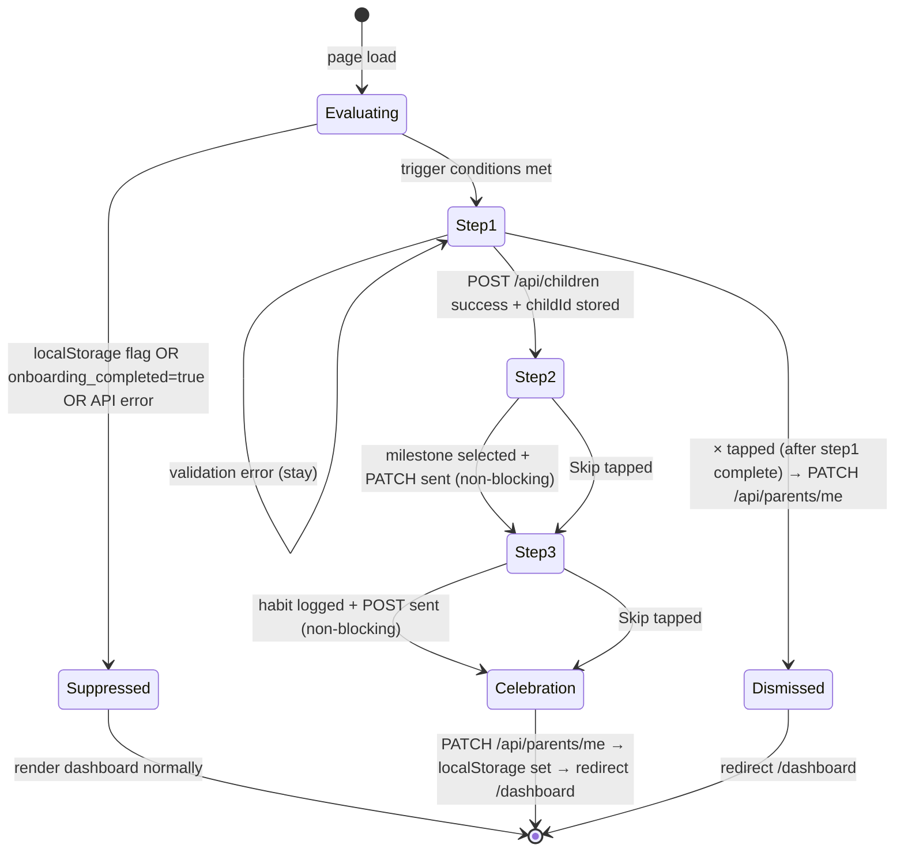

# Design Document: Onboarding Wizard

## Overview

The Onboarding Wizard is a 3-step guided flow that appears immediately after a new parent signs up on SKIDS Parent. It reduces post-signup drop-off by guiding parents through three high-value first actions: adding a child profile, logging a developmental milestone, and logging a daily H.A.B.I.T.S. entry.

The wizard renders as a full-screen overlay (mobile) or centred modal (desktop), uses smooth animated step transitions, and ends with a celebration screen before redirecting to the dashboard. Once completed or dismissed after step 1, it never appears again.

### Key Design Decisions

- **No new routing** — the wizard mounts as an overlay inside the existing dashboard layout, avoiding a separate page and preserving the dashboard URL.
- **Optimistic localStorage gate** — `skids_onboarding_complete` in localStorage suppresses the wizard immediately on fast subsequent loads, preventing flash-of-wizard before the API responds.
- **Non-blocking steps 2 and 3** — milestone and habit API failures show a toast but never block the parent from completing the flow. Only step 1 (child creation) is a hard gate.
- **Existing API reuse** — `POST /api/children`, `POST /api/milestones` (upsert), and `POST /api/habits` already exist. Only `GET /api/parents/me` and `PATCH /api/parents/me` are new.
- **CSS transitions over Framer Motion** — keeps the bundle lean for a mobile-first PWA; Tailwind's `transition-all` and `translate-x` classes handle step slides.

---

## Architecture

### Component Tree

```
DashboardLayout (Astro)
└── OnboardingGate (React, client:load)
    ├── [loading skeleton — 2s max]
    └── OnboardingWizard (React)
        ├── WizardShell
        │   ├── StepIndicator
        │   └── CloseButton (visible after step 1 complete)
        ├── StepContainer (animated slide)
        │   ├── Step1ChildForm
        │   ├── Step2Milestones
        │   └── Step3Habits
        └── CelebrationScreen
```

### Data Flow

```
Firebase Auth token
        │
        ▼
OnboardingGate
  1. Check localStorage("skids_onboarding_complete") → suppress if "true"
  2. GET /api/parents/me  → { onboarding_completed, parentId }
  3. GET /api/children    → { children[] }
  4. Evaluate trigger conditions
        │
        ▼ (wizard should show)
OnboardingWizard
  Step 1 → POST /api/children → childId stored in state
  Step 2 → GET milestones from seeded DB (already seeded by POST /api/children)
         → PATCH /api/milestones/{id} (non-blocking on failure)
  Step 3 → POST /api/habits (non-blocking on failure)
  Celebration → PATCH /api/parents/me { onboarding_completed: true }
             → localStorage.setItem("skids_onboarding_complete", "true")
             → redirect /dashboard
```

### Trigger Logic (OnboardingGate)

```
show wizard IF:
  localStorage("skids_onboarding_complete") !== "true"
  AND onboarding_completed === false (from GET /api/parents/me)
  AND (isNew === true OR children.length === 0)

suppress wizard IF:
  localStorage("skids_onboarding_complete") === "true"   ← fast path, no API wait
  OR onboarding_completed === true
  OR API error during evaluation
```

---

## Components and Interfaces

### OnboardingGate

`src/components/auth/OnboardingGate.tsx`

```typescript
interface OnboardingGateProps {
  token: string        // Firebase ID token
  children: ReactNode  // Dashboard content rendered behind/after wizard
}
```

Responsibilities:
- Reads `skids_onboarding_complete` from localStorage on mount (synchronous, no flash)
- Fetches `GET /api/parents/me` and `GET /api/children` in parallel
- Renders a loading skeleton (max 2 s via `setTimeout` fallback) while evaluating
- Mounts `<OnboardingWizard>` when trigger conditions are met
- Passes `token`, `parentId`, and `onComplete` callback to the wizard

### OnboardingWizard

`src/components/onboarding/OnboardingWizard.tsx`

```typescript
interface OnboardingWizardProps {
  token: string
  parentId: string
  onComplete: () => void   // called after PATCH /api/parents/me succeeds or fails
}

// Internal state shape
interface WizardState {
  step: 0 | 1 | 2 | 3      // 0=step1, 1=step2, 2=step3, 3=celebration
  childId: string | null
  childName: string
  childAgeMonths: number
  selectedMilestoneId: string | null
  selectedMilestoneStatus: 'achieved' | 'in_progress' | null
  selectedHabitKey: string | null
  milestoneLogged: boolean
  habitLogged: boolean
  step1Complete: boolean    // enables close button
}
```

### StepIndicator

```typescript
interface StepIndicatorProps {
  current: 1 | 2 | 3   // 1-indexed for display
  total: 3
}
```

Renders 3 dots: active = `bg-green-500 w-3 h-3`, inactive = `bg-gray-200 w-2 h-2`. Includes `aria-label="Step {current} of {total}"`.

### Step1ChildForm

```typescript
interface Step1Props {
  token: string
  onSuccess: (childId: string, name: string, ageMonths: number) => void
}
```

Fields: name (text), dob (date), gender (Boy/Girl/Other selector). Validates before calling `POST /api/children`. Disables CTA during in-flight request.

### Step2Milestones

```typescript
interface Step2Props {
  token: string
  childId: string
  childName: string
  ageMonths: number
  onComplete: (milestoneId: string | null, status: string | null, logged: boolean) => void
  onSkip: () => void
}
```

Loads milestones from `GET /api/milestones?childId={id}`, filters to 3–6 age-appropriate cards using `getMilestonesForAge`. Calls `POST /api/milestones` (upsert) on selection. Failure shows toast, still advances.

### Step3Habits

```typescript
interface Step3Props {
  token: string
  childId: string
  childName: string
  onComplete: (habitKey: string | null, logged: boolean) => void
  onSkip: () => void
}
```

Renders all 6 HABITS cards. On "Log for Today", calls `POST /api/habits`. Failure shows toast, still advances to celebration.

### CelebrationScreen

```typescript
interface CelebrationProps {
  childName: string
  milestoneLogged: boolean
  habitLogged: boolean
  onDone: () => void   // triggers PATCH /api/parents/me + redirect
}
```

Animated checkmark in green circle, CSS confetti burst, summary text, auto-redirects after 2.5 s.

---

## Data Models

### DB Schema Change — `parents` table

Add `onboarding_completed` boolean column (default `false`).

Migration file: `migrations/0004_onboarding_wizard.sql`

```sql
-- Migration: 0004_onboarding_wizard
-- Adds onboarding_completed flag to parents table

ALTER TABLE parents ADD COLUMN onboarding_completed INTEGER NOT NULL DEFAULT 0;
```

> D1 uses SQLite; booleans are stored as `INTEGER` (0/1). The Drizzle schema in `src/lib/db/schema.ts` should also be updated to add `onboardingCompleted: integer('onboarding_completed', { mode: 'boolean' }).default(false)` to the `parents` table definition.

### API Request/Response Shapes

**GET /api/parents/me**
```typescript
// Response 200
{
  id: string
  name: string
  email: string | null
  onboarding_completed: boolean
}
```

**PATCH /api/parents/me**
```typescript
// Request body
{ onboarding_completed: true }

// Response 200
{ updated: true }
```

**POST /api/habits** (existing, no change needed)
```typescript
// Request body (wizard usage)
{
  childId: string
  habitType: string   // one of the 6 HABITS keys
  date: string        // today's ISO date
  valueJson: {}       // empty object default
}
```

**POST /api/milestones** (existing upsert, no change needed)
```typescript
// Request body (wizard usage)
{
  childId: string
  milestoneKey: string
  title: string
  category: string
  status: 'achieved' | 'in_progress'
  observedAt?: string   // ISO date, only for 'achieved'
}
```

---

## API Routes

### GET /api/parents/me

`src/pages/api/parents/me.ts`

```typescript
export const GET: APIRoute = async ({ request, locals }) => {
  const env = (locals as any).runtime?.env || {}
  const parentId = await getParentId(request, env)
  if (!parentId) return new Response(JSON.stringify({ error: 'Unauthorized' }), { status: 401 })

  const row = await env.DB.prepare(
    'SELECT id, name, email, onboarding_completed FROM parents WHERE id = ?'
  ).bind(parentId).first()

  if (!row) return new Response(JSON.stringify({ error: 'Not found' }), { status: 404 })

  return new Response(JSON.stringify({
    id: row.id,
    name: row.name,
    email: row.email,
    onboarding_completed: Boolean(row.onboarding_completed),
  }), { status: 200, headers: { 'Content-Type': 'application/json' } })
}
```

### PATCH /api/parents/me

```typescript
export const PATCH: APIRoute = async ({ request, locals }) => {
  const env = (locals as any).runtime?.env || {}
  const parentId = await getParentId(request, env)
  if (!parentId) return new Response(JSON.stringify({ error: 'Unauthorized' }), { status: 401 })

  const body = await request.json() as { onboarding_completed?: boolean }

  if (body.onboarding_completed === true) {
    await env.DB.prepare(
      "UPDATE parents SET onboarding_completed = 1 WHERE id = ?"
    ).bind(parentId).run()
  }

  return new Response(JSON.stringify({ updated: true }), {
    status: 200,
    headers: { 'Content-Type': 'application/json' },
  })
}
```

### POST /api/habits (idempotency note)

The existing `POST /api/habits` already handles the "already logged today" case by toggling (delete). For the wizard, we only ever log once and never toggle off, so the wizard should check the response for `{ removed: true }` and treat it as a no-op success (the habit was already logged today, which is fine).

---

## UI Specification

### Layout

- Mobile (< 768px): `fixed inset-0 z-[9999] bg-white flex flex-col`
- Desktop (≥ 768px): `fixed inset-0 z-[9999] bg-black/40 backdrop-blur-sm flex items-center justify-center` with inner `bg-white rounded-3xl w-full max-w-[480px] max-h-[90vh] overflow-y-auto`

### Step Transitions

CSS-only slide: each step is absolutely positioned. On advance, outgoing step gets `translate-x-[-100%] opacity-0`, incoming gets `translate-x-0 opacity-100`. Transition: `transition-all duration-300 ease-in-out`.

```css
/* Tailwind classes on step wrapper */
.step-enter  { transform: translateX(100%); opacity: 0; }
.step-active { transform: translateX(0);    opacity: 1; transition: all 300ms ease-in-out; }
.step-exit   { transform: translateX(-100%); opacity: 0; transition: all 300ms ease-in-out; }
```

### Color Palette

| Token | Value | Usage |
|---|---|---|
| Primary | `green-500` (#22c55e) | CTA buttons, active dots, selected cards |
| Primary bg | `green-50` | Selected card backgrounds, success banners |
| Heading | `gray-900` | Step titles (text-2xl font-bold) |
| Body | `gray-500` | Subtitles, helper text (text-sm) |
| Card bg | `white` | All cards |
| Card border | `gray-100` | Default card border |
| Selected border | `green-500` | Selected milestone/habit card |

### Button Styles

- Primary CTA: `bg-green-500 text-white rounded-xl py-3 px-6 font-semibold text-base w-full hover:bg-green-600 active:bg-green-700 transition-colors disabled:opacity-40`
- Skip: `text-gray-400 text-sm font-medium py-2 hover:text-gray-600 transition-colors`
- Close (×): `absolute top-4 right-4 w-8 h-8 rounded-full bg-gray-100 flex items-center justify-center text-gray-500 hover:bg-gray-200 transition-colors` with `aria-label="Close wizard"`

### Card Styles

- Default: `bg-white rounded-2xl shadow-sm border border-gray-100 p-4 cursor-pointer hover:shadow-md transition-shadow`
- Selected: `bg-green-50 border-green-500 shadow-sm`
- Milestone card: 2-column grid on ≥ 400px, 1-column on < 400px
- Habit card: same responsive grid

### Step Indicator

```tsx
<div role="progressbar" aria-label={`Step ${current} of ${total}`} aria-valuenow={current} aria-valuemin={1} aria-valuemax={total}>
  {[1,2,3].map(i => (
    <div key={i} className={`rounded-full transition-all duration-300 ${
      i === current ? 'w-3 h-3 bg-green-500' : 'w-2 h-2 bg-gray-200'
    }`} />
  ))}
</div>
```

### Celebration Screen

- Large green circle (w-20 h-20) with animated checkmark SVG (`stroke-dashoffset` animation, 600ms)
- CSS confetti: 12 `<span>` elements with `@keyframes confetti-fall` (random x, rotation, delay)
- Heading: `"You're all set for {childName}! 🎉"` — `text-2xl font-bold text-gray-900`
- Summary: child name, milestone title (if logged), habit name (if logged) in `bg-green-50 rounded-2xl p-4`
- Auto-redirect after 2500ms via `setTimeout(() => window.location.href = '/dashboard', 2500)`
- Respects `prefers-reduced-motion`: if set, skip confetti animation and use static checkmark

### Loading Skeleton

```tsx
<div className="fixed inset-0 z-[9999] bg-white flex flex-col items-center justify-center gap-4">
  <div className="w-16 h-16 rounded-full bg-gray-100 animate-pulse" />
  <div className="w-48 h-4 rounded-full bg-gray-100 animate-pulse" />
  <div className="w-32 h-3 rounded-full bg-gray-100 animate-pulse" />
</div>
```

Suppressed after 2 s via `setTimeout` fallback that hides the wizard if APIs haven't resolved.

---

## Integration Point

The wizard is mounted in the dashboard layout. The dashboard page passes the Firebase token to `OnboardingGate`, which wraps the dashboard content:

```astro
<!-- src/pages/dashboard.astro (or equivalent) -->
<OnboardingGate token={firebaseToken} client:load>
  <!-- existing dashboard content -->
  <ChildDashboard ... />
</OnboardingGate>
```

`OnboardingGate` renders its `children` prop immediately (dashboard is visible behind the overlay on desktop, hidden on mobile due to full-screen). The wizard overlay sits on top via `z-[9999]`.

Body scroll lock is applied via `document.body.style.overflow = 'hidden'` on wizard mount and restored on unmount via a `useEffect` cleanup.

---

## Mermaid Diagram — Wizard State Machine



---

## Correctness Properties

*A property is a characteristic or behavior that should hold true across all valid executions of a system — essentially, a formal statement about what the system should do. Properties serve as the bridge between human-readable specifications and machine-verifiable correctness guarantees.*

### Property 1: Completion flag suppresses wizard

*For any* parent whose `onboarding_completed` flag is `true` (in DB or localStorage), the `OnboardingGate` should evaluate to "suppress" regardless of the value of `isNew` or the number of children.

**Validates: Requirements 1.3, 7.4, 7.6**

### Property 2: Trigger conditions are correctly evaluated

*For any* parent state where `onboarding_completed = false` and `children.length = 0`, the `OnboardingGate` should evaluate to "show wizard". Conversely, for any parent with `children.length > 0` and `onboarding_completed = false`, the wizard should only show if `isNew = true`.

**Validates: Requirements 1.1, 1.2**

### Property 3: Step indicator reflects current step

*For any* wizard step value in {1, 2, 3}, the `StepIndicator` component should render exactly one active dot (green-500) at the position matching the current step, and the remaining dots should be inactive (gray-200).

**Validates: Requirements 2.2**

### Property 4: CTA button enabled state matches form validity

*For any* state of the Step 1 form, the "Continue" button should be enabled if and only if the name field is non-empty (after trimming) and the dob field is non-empty.

**Validates: Requirements 2.3, 3.1, 3.6, 3.7**

### Property 5: Child name validation rejects invalid lengths

*For any* string of length 0 (empty or whitespace-only) or length > 50, submitting Step 1 should be rejected with an inline validation message and the `POST /api/children` API should not be called.

**Validates: Requirements 3.1, 3.6**

### Property 6: DOB validation enforces age range

*For any* date outside the range [today − 16 years, today], the Step 1 form should reject the input and display an inline validation message without calling `POST /api/children`.

**Validates: Requirements 3.2, 3.7**

### Property 7: Step 1 submission round-trip

*For any* valid child form data (name 1–50 chars, dob in valid range, optional gender), submitting Step 1 should result in a `POST /api/children` call with exactly those field values, and on success the returned `childId` should be stored in wizard state and available for steps 2 and 3.

**Validates: Requirements 3.4, 3.5**

### Property 8: Age-appropriate milestones are shown

*For any* child age in months, the milestones displayed in Step 2 should be a subset of `getMilestonesForAge(ageMonths)` with a count between 3 and 6 (inclusive), prioritising milestones where `expectedAgeMin <= ageMonths <= expectedAgeMax`.

**Validates: Requirements 4.1, 4.2**

### Property 9: Milestone status update round-trip

*For any* milestone card and any status selection ("achieved" or "in_progress"), tapping the selection should result in a `POST /api/milestones` call with the correct `milestoneKey`, `childId`, `status`, and (for "achieved") an `observedAt` ISO date string.

**Validates: Requirements 4.4, 4.5**

### Property 10: Milestone card renders required fields

*For any* milestone in the displayed list, the rendered card should contain the milestone `title`, the `category` label, and the category emoji from `MILESTONE_CATEGORIES`.

**Validates: Requirements 4.6**

### Property 11: Contextual messages contain child name

*For any* child name, the contextual message above the milestone list (Step 2) and the contextual message above the habit grid (Step 3) should both contain the child's name as a substring.

**Validates: Requirements 4.9, 5.7**

### Property 12: All 6 HABITS cards render required fields

*For any* render of Step 3, all 6 entries from the `HABITS` array should be present, each card containing the habit's `emoji`, `name`, and `tagline`.

**Validates: Requirements 5.1**

### Property 13: Habit log round-trip

*For any* selected habit key, tapping "Log for Today" should result in a `POST /api/habits` call with the correct `childId`, `habitType` matching the selected key, today's ISO date, and `valueJson: {}`.

**Validates: Requirements 5.3**

### Property 14: Skip never calls persistence APIs

*For any* wizard step where Skip is available (steps 2 and 3), tapping Skip should advance the step without making any API call for that step's data (no `POST /api/milestones`, no `POST /api/habits`).

**Validates: Requirements 2.6, 4.7, 5.5**

### Property 15: Celebration screen contains child name and summary

*For any* child name and any combination of (milestoneLogged: boolean, habitLogged: boolean), the Celebration screen should display the child's name in the success heading, and the summary section should include the milestone title if and only if `milestoneLogged = true`, and the habit name if and only if `habitLogged = true`.

**Validates: Requirements 6.2, 6.6**

### Property 16: Completion flag persistence round-trip

*For any* parent who reaches the Celebration screen, the `PATCH /api/parents/me` call should set `onboarding_completed = true`, and a subsequent `GET /api/parents/me` for the same parent should return `onboarding_completed: true`. Additionally, `localStorage.getItem("skids_onboarding_complete")` should equal `"true"` after completion.

**Validates: Requirements 6.3, 7.2, 7.5**

### Property 17: Analytics events fire with correct properties

*For any* wizard session, the analytics events should fire with the correct property shapes:
- `onboarding_wizard_started` fires on first render with `{ parentId, trigger }`
- `onboarding_step_completed` fires on step 1 advance with `{ step: 1, childId }`
- `onboarding_step_skipped` fires on skip with `{ step: 2 | 3 }`
- `onboarding_wizard_completed` fires on celebration with `{ childId, milestoneLogged: boolean, habitLogged: boolean }`

**Validates: Requirements 10.1, 10.2, 10.3, 10.4**

---

## Error Handling

| Scenario | Behaviour |
|---|---|
| `GET /api/parents/me` fails during gate evaluation | Suppress wizard, render dashboard normally |
| `GET /api/children` fails during gate evaluation | Suppress wizard, render dashboard normally |
| `POST /api/children` fails (Step 1) | Show inline error message, keep user on Step 1, do not advance |
| `POST /api/milestones` fails (Step 2) | Show non-blocking toast (`"Couldn't save milestone — you can update it later"`), advance to Step 3 |
| `POST /api/habits` fails (Step 3) | Show non-blocking toast (`"Couldn't log habit — try again from the dashboard"`), advance to Celebration |
| `PATCH /api/parents/me` fails (Celebration) | Still redirect to `/dashboard`; retry the PATCH once after 3 s in the background |
| Network offline during any step | Show inline error with retry button; do not advance until resolved (Step 1) or advance with toast (Steps 2–3) |

Toast implementation: a simple `<div>` with `fixed bottom-4 left-1/2 -translate-x-1/2 bg-gray-900 text-white text-sm px-4 py-2 rounded-xl shadow-lg z-[10000]` that auto-dismisses after 3 s.

---

## Testing Strategy

### Dual Testing Approach

Both unit tests and property-based tests are required. Unit tests cover specific examples, integration points, and error conditions. Property tests verify universal correctness across all inputs.

### Unit Tests

Focus areas:
- `OnboardingGate` trigger logic: specific combinations of `isNew`, `children.length`, `onboarding_completed`, and localStorage state
- Step 1 form validation: empty name, whitespace-only name, name > 50 chars, invalid DOB, DOB out of range
- `StepIndicator` rendering: correct active/inactive dot for each step value
- `CelebrationScreen` summary: correct conditional rendering of milestone and habit summary lines
- API route handlers: `GET /api/parents/me` returns correct shape, `PATCH /api/parents/me` updates DB correctly
- Error states: API failure on Step 1 keeps user on step, API failure on Steps 2–3 advances with toast
- Accessibility: `role="dialog"`, `aria-modal="true"`, `aria-label` on step indicator, focus trap on open

### Property-Based Tests

Library: **fast-check** (TypeScript-native, works in Vitest)

Configuration: minimum 100 runs per property (`{ numRuns: 100 }`).

Each property test must include a comment tag in the format:
`// Feature: onboarding-wizard, Property {N}: {property_text}`

**Property 1 test** — `fc.record({ onboardingCompleted: fc.constant(true), isNew: fc.boolean(), childCount: fc.nat() })` → gate always suppresses.

**Property 2 test** — `fc.record({ onboardingCompleted: fc.constant(false), isNew: fc.boolean(), childCount: fc.nat(10) })` → gate shows wizard when `isNew || childCount === 0`.

**Property 3 test** — `fc.integer({ min: 1, max: 3 })` → StepIndicator renders exactly one active dot at the correct position.

**Property 4 test** — `fc.record({ name: fc.string(), dob: fc.string() })` → CTA enabled iff `name.trim().length > 0 && dob !== ''`.

**Property 5 test** — `fc.oneof(fc.constant(''), fc.string({ maxLength: 0 }), fc.stringOf(fc.constant(' ')), fc.string({ minLength: 51 }))` → form rejects, no API call.

**Property 6 test** — `fc.date({ min: new Date(0), max: new Date() })` filtered to outside valid range → form rejects.

**Property 7 test** — `fc.record({ name: fc.string({ minLength: 1, maxLength: 50 }), dob: fc.date(...) })` → POST called with exact fields, childId stored.

**Property 8 test** — `fc.integer({ min: 0, max: 192 })` (0–16 years in months) → milestone count in [3, 6] and all within age range.

**Property 9 test** — `fc.record({ milestoneKey: fc.string(), status: fc.oneof(fc.constant('achieved'), fc.constant('in_progress')) })` → POST called with correct fields.

**Property 10 test** — `fc.constantFrom(...MILESTONES)` → rendered card contains title, category label, emoji.

**Property 11 test** — `fc.string({ minLength: 1 })` as child name → contextual messages in Step 2 and Step 3 contain the name.

**Property 12 test** — render Step 3 → all 6 HABITS keys present, each card has emoji, name, tagline.

**Property 13 test** — `fc.constantFrom(...HABITS.map(h => h.key))` → POST /api/habits called with correct fields.

**Property 14 test** — `fc.integer({ min: 2, max: 3 })` as step → skip advances step without API call.

**Property 15 test** — `fc.record({ childName: fc.string({ minLength: 1 }), milestoneLogged: fc.boolean(), habitLogged: fc.boolean() })` → celebration renders name, milestone iff logged, habit iff logged.

**Property 16 test** — simulate completion → DB row has `onboarding_completed = 1`, GET returns `true`, localStorage has `"true"`.

**Property 17 test** — `fc.record({ parentId: fc.uuid(), trigger: fc.oneof(fc.constant('new_user'), fc.constant('no_children')) })` → analytics events fire with correct property shapes at each wizard stage.
