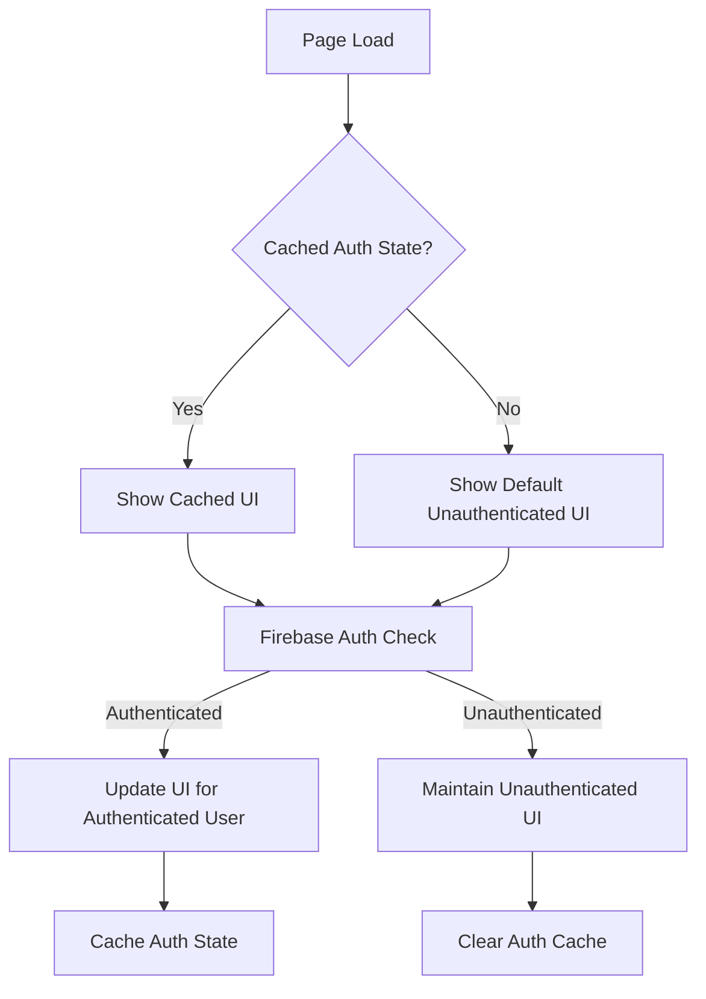

# Design Document: Public Onboarding & Navigation Redesign

## Overview

This design implements a trust-based conversion strategy for the SKIDS Parent platform, prioritizing maximum content reach (targeting millions of blog readers) and natural conversion through demonstrated value. The system provides real value to all users—free tier users get 20 AI questions/day, health tracking, community access, and basic PDF export—while premium enhances the experience with 100 AI questions/day, detailed health score breakdown, teleconsult discount, and unlimited children profiles.

The design supports three distinct user journeys:

1. **Anonymous blog readers**: Access all content freely, build trust through SEO-optimized articles, discover platform value without interruption
2. **Curious explorers**: Experience Dr. SKIDS AI with general answers, browse community discussions, see contextual value-focused sign-in prompts (never blocking)
3. **Authenticated users**: Access personalized features, encounter natural upgrade triggers when hitting meaningful limits (20 questions/day, single child profile)

The architecture emphasizes frictionless exploration with complete navigation (logo links home, community has back button), comprehensive analytics tracking (G4 and Meta pixel throughout), and value-based conversion where users upgrade to solve real problems they're experiencing.

Key design principles:

- **Trust-first philosophy**: All users get real value, premium enhances rather than gates
- **Human-centered design**: Open mindset encouraging exploration and risk-taking
- **Progressive disclosure**: Features revealed gradually without overwhelming users
- **Contextual value communication**: Sign-in and upgrade prompts explain specific problems solved, never block access
- **Performance-first**: Static content loads immediately, authentication state determined asynchronously
- **Mobile-responsive**: Touch-optimized navigation with appropriate layouts for all screen sizes
- **Accessibility**: Keyboard navigation, screen reader support, and ARIA labels throughout
- **Data-driven optimization**: G4 and Meta pixel tracking throughout to measure reach, engagement, and conversion

## Architecture

### System Components

The system consists of six primary architectural layers:

1. **Navigation Layer**: Global navigation components (Navbar with logo→home link, MobileTabBar, back navigation) that adapt based on authentication state and screen size
2. **Authentication Layer**: Firebase-based authentication with session management and state caching
3. **Content Layer**: Fully public content (blogs, read-only community, discover pages) with no access restrictions
4. **Personalization Layer**: Features requiring authentication for personalized experience (Dr. SKIDS AI personalization, timeline, community posting, intervention booking)
5. **Value Communication Layer**: Contextual sign-in and upgrade prompts that explain specific benefits without blocking access
6. **Analytics Layer**: G4 and Meta pixel tracking throughout the user journey (blog views, engagement depth, sign-in prompts, conversions)

### Component Hierarchy

```
BaseLayout
├── Analytics Scripts (G4 + Meta Pixel)
├── Navbar (always visible)
│   ├── Logo (links to homepage - Requirement 2.1)
│   ├── Navigation Links (Blog, Discover, Community, Timeline, Interventions)
│   ├── NotificationBell (authenticated users only)
│   └── NavbarUser (authenticated users only)
├── Main Content
│   ├── Public Content (blogs with SEO optimization, discover, read-only community)
│   ├── Personalized Content (timeline, community posting, interventions)
│   └── Value-Focused Prompts (contextual, non-blocking, explain benefits)
├── Footer (always visible)
├── MobileTabBar (mobile only, always visible)
└── ChatWidget (floating, always visible - general answers for all, personalization requires sign-in)
```

### Authentication Flow



### Navigation State Machine

The navigation system operates as a state machine with the following states:

- **Anonymous**: User not authenticated, sees all public content and navigation, experiences platform value freely
- **Exploring**: User interacting with personalized features, sees contextual value-focused prompts explaining benefits
- **Authenticating**: User in sign-in flow, context preserved for return
- **Authenticated Free**: User signed in on free tier, sees personalized features, encounters natural upgrade triggers at meaningful limits (20 AI questions/day, single child profile)
- **Authenticated Premium**: User on premium tier, full access to enhanced features (100 AI questions/day, detailed health score, unlimited children)

## Components and Interfaces

### Navigation Components

#### Navbar Component

**Location**: `src/components/common/Navbar.astro`

**Responsibilities**:

- Display logo with homepage link (Requirement 2.1)
- Render navigation links (Blog, Discover, Community, Timeline, Interventions)
- Show NotificationBell for authenticated users
- Display NavbarUser component for authenticated users
- Indicate active page visually (Requirement 2.5)
- Adapt layout for desktop screens (≥768px)
- Maintain consistent display across all pages regardless of authentication state (Requirement 2.3)

**Props**: None (uses Astro.url.pathname for active state)

**State Management**: Stateless, relies on server-side rendering and client-side auth detection

**Implementation Notes**:

- Logo click handler must navigate to `/` (homepage)
- Active page indication uses visual styling (border, color, or background)
- All navigation links remain visible and functional for unauthenticated users
- Authentication-dependent elements (NotificationBell, NavbarUser) conditionally render based on auth state

#### MobileTabBar Component

**Location**: `src/components/common/MobileTabBar.astro`

**Responsibilities**:

- Display bottom navigation bar on mobile (<768px) (Requirement 9.1)
- Provide access to primary destinations (Home, Discover, Timeline, Reports, Me)
- Indicate active tab visually (Requirement 2.5)
- Handle safe area insets for notched devices
- Ensure touch targets are at least 44 pixels (Requirement 9.4)
- Maintain consistent display across all pages (Requirement 2.4)

**Props**: None (uses Astro.url.pathname for active state)

**State Management**: Stateless

**Implementation Notes**:

- Touch target sizing must meet 44px minimum for accessibility
- Safe area insets handled via CSS `env(safe-area-inset-bottom)`
- Active tab indication uses visual styling consistent with Navbar
- Displays on viewport width < 768px, hidden on larger screens

#### NavbarUser Component

**Location**: `src/components/auth/NavbarUser.tsx`

**Responsibilities**:
- Display user avatar or sign-in button based on authentication state
- Provide dropdown menu for authenticated users (Profile, Settings, Sign Out)
- Handle sign-in navigation with redirect parameter

**Props**: None (uses useAuth hook)

**State Management**: 
- `user`: Current Firebase user object
- `loading`: Authentication state loading indicator
- `dropdownOpen`: Dropdown menu visibility

### Authentication Components

#### useAuth Hook

**Location**: `src/lib/hooks/useAuth.ts`

**Interface**:
```typescript
interface UseAuthReturn {
  user: User | null
  loading: boolean
  token: string | null
  signInWithGoogle: () => Promise<User>
  signOut: () => Promise<void>
}
```

**Responsibilities**:
- Listen to Firebase auth state changes
- Provide current user object and ID token
- Expose sign-in and sign-out methods
- Manage loading state during auth resolution

#### LoginForm Component

**Location**: `src/components/auth/LoginForm.tsx`

**Responsibilities**:
- Provide Google sign-in button
- Provide phone number + OTP authentication flow
- Handle referral code preservation
- Sync session with backend after authentication
- Redirect to intended destination after sign-in

**State Management**:
- `phone`: Phone number input
- `otp`: OTP input
- `step`: Current authentication step (idle, sending, otp, verifying, syncing)
- `confirmation`: Firebase ConfirmationResult for OTP verification
- `error`: Error message display

### Content Access Control

#### Public Content Pages

**Pages**:

- `/` (Homepage)
- `/blog` (Blog listing)
- `/blog/[slug]` (Individual blog posts - SEO optimized)
- `/discover` (Organ discovery listing)
- `/discover/[slug]` (Individual organ pages)
- `/community` (Forum groups listing, read-only)
- `/community/[groupId]` (Individual group discussions, read-only)

**Access**: No authentication required (Requirement 1.1-1.5)

**Behavior**:

- Render complete content without authentication checks
- Display navigation with all links visible (Requirement 1.6)
- No modal overlays or blocking prompts on initial load (Requirement 1.7)
- Blog posts include complete SEO optimization (meta tags, Open Graph, Twitter Cards, structured data) (Requirement 14.1-14.7)
- Community pages display back navigation to homepage (Requirement 2.2)
- Track page views with G4 and Meta pixel (Requirement 10.1)

**SEO Optimization for Blog Posts**:

- Complete meta tags: title, description, keywords, canonical URL
- Open Graph tags: og:title, og:description, og:image, og:url
- Twitter Card tags for Twitter sharing
- Semantic HTML structure: `<article>`, `<header>`, `<section>` tags
- Server-side rendering (not client-side) for search engine indexing
- Structured data markup (JSON-LD) for rich search results where applicable
- No authentication requirements or paywalls blocking content

#### Personalized Content Pages

**Pages**:

- `/timeline` (Health timeline with Dr. SKIDS chat)
- `/interventions` (Intervention booking)
- `/me` (User profile and settings)

**Access**: Authentication required for personalization (Requirement 4.1)

**Behavior**:

- Redirect to `/login?redirect=[current-path]` if unauthenticated
- Preserve intended destination for post-authentication redirect (Requirement 11.1-11.2)
- Display full functionality for authenticated users
- Track authentication redirects with G4 and Meta pixel (Requirement 10.2)

### Value-Focused Prompt Components

#### ChatWidget Sign-In Prompt

**Location**: `src/components/chat/ChatWidget.tsx`

**Trigger**: User sends message while unauthenticated (Requirement 3.2)

**Behavior**:

- Provide general answer to the user's question (Requirement 3.2)
- Display message explaining personalized guidance requires sign-in (Requirement 3.3)
- Include value proposition: personalized answers based on child's age and profile (Requirement 3.4)
- Provide clear call-to-action to sign in (Requirement 3.5)
- Do NOT block chat interface with modal overlays (Requirement 3.6)
- Allow multiple questions with general answers, displaying prompt contextually (Requirement 3.7)
- Track sign-in prompt views with G4 and Meta pixel (Requirement 10.2)

**Message Template**:

```
[General answer to user's question]

That's a great question — and I want to give you a proper answer based on your child's age and profile.

To do that, I need you to sign in first. It only takes a moment, and then I can give you personalised guidance.

Tap "Sign In" at the top to get started!
```

**Implementation Notes**:

- General answers provided by AI without personalization context
- Sign-in prompt appears inline within chat conversation, not as blocking modal
- Prompt emphasizes value benefit (personalization) rather than restriction
- Call-to-action links to `/login?redirect=/timeline` to return to chat after sign-in

#### Community Sign-In Prompt

**Location**: `src/pages/community/[groupId].astro` (to be created)

**Trigger**:

- User attempts to post in community (Requirement 4.2)
- User attempts to react to a post (Requirement 4.3)
- User scrolls through 3+ posts (subtle prompt) (Requirement 12.6)

**Behavior**:

- Display inline prompt explaining sign-in unlocks participation
- Include value proposition: join the conversation, share experiences (Requirement 4.5, 12.7)
- Provide sign-in button with redirect back to current page (Requirement 11.1)
- Do NOT block reading with modal overlays
- Display back navigation to homepage (Requirement 2.2)
- Track sign-in prompt views with G4 and Meta pixel (Requirement 10.2)

**Implementation Notes**:

- Prompt appears inline within community page, not as blocking modal
- Emphasizes value of joining conversation rather than restriction
- Scroll-triggered prompt appears after 3 posts viewed, limited to once per session (Requirement 13.5)
- Back navigation button visible at top of community page linking to `/`

#### Intervention Sign-In Prompt

**Location**: `src/pages/interventions/index.astro` (to be created)

**Trigger**: User attempts to book an intervention (Requirement 4.4)

**Behavior**:

- Display prompt explaining booking requires account
- Include value proposition: track appointments, receive reminders (Requirement 4.5)
- Provide sign-in button with redirect back to interventions page (Requirement 11.1)
- Track sign-in prompt views with G4 and Meta pixel (Requirement 10.2)

**Implementation Notes**:

- Prompt appears when user clicks booking action
- Emphasizes value of tracking and reminders rather than restriction
- Redirect parameter preserves intervention context

### Premium Upgrade Prompts

#### Dr. SKIDS Usage Limit Prompt

**Location**: `src/components/chat/ChatWidget.tsx`

**Trigger**:

- User reaches daily AI question limit (20 for free tier) (Requirement 6.2)
- Display remaining count when below 6 questions (Requirement 6.1)

**Behavior**:

- Show remaining question count after each interaction when below 6 questions
- When limit reached, display upgrade prompt
- Explain premium benefits in terms of parent problems: "Have frequent questions? Get 100 AI answers per day" (Requirement 7.1)
- Provide call-to-action to view subscription options (Requirement 6.6)
- Link to `/pricing` or `/subscription` page
- Track upgrade prompt views with G4 and Meta pixel (Requirement 10.4)
- Track daily usage count per user (Requirement 6.7)

**Message Template** (when limit reached):

```
You've used all 20 free questions for today.

Have frequent questions about your child's health? Upgrade to SKIDS Premium for 100 AI answers per day, plus detailed health score breakdown and teleconsult discount.

[View Premium Benefits]
```

**Implementation Notes**:

- Usage count tracked per user per day in database
- Remaining count displayed inline in chat interface
- Upgrade prompt emphasizes problem solved (frequent questions) rather than just listing features (Requirement 6.5)
- Premium benefits explained in context of parent needs (Requirement 7.1)

#### Health Score Premium Indicator

**Location**: `src/components/health/HealthScoreDisplay.tsx` (to be created)

**Trigger**: Authenticated user views their child's health score (Requirement 6.3)

**Behavior**:

- Display overall health score for free tier users
- Show subtle indicator that premium unlocks detailed component breakdown
- Explain value: "Want to understand your child's health in detail? Get component score breakdown" (Requirement 7.1)
- Provide call-to-action to view subscription options (Requirement 6.6)
- Track upgrade prompt views with G4 and Meta pixel (Requirement 10.4)

**Implementation Notes**:

- Indicator appears as subtle UI element (e.g., "🔒 Detailed breakdown available with Premium")
- Emphasizes problem solved (understanding specific health areas) rather than just feature listing (Requirement 6.5)
- Non-intrusive, doesn't block viewing of overall score

#### Multiple Children Profile Prompt

**Location**: `src/components/auth/ChildRegistration.tsx`

**Trigger**: Authenticated user attempts to add a second child profile (Requirement 6.4)

**Behavior**:

- Display upgrade prompt explaining premium supports unlimited children
- Explain value: "Have multiple children? Track unlimited profiles" (Requirement 7.1)
- Provide call-to-action to view subscription options (Requirement 6.6)
- Track upgrade prompt views with G4 and Meta pixel (Requirement 10.4)

**Implementation Notes**:

- Prompt appears when user clicks "Add Child" button and already has one child on free tier
- Emphasizes problem solved (multiple children tracking) rather than just feature listing (Requirement 6.5)
- Clear explanation that free tier supports single child, premium supports unlimited

### Analytics Tracking Implementation

#### G4 (Google Analytics 4) Integration

**Location**: `src/layouts/BaseLayout.astro`

**Events to Track**:

1. **Page Views** (Requirement 10.1):
   - Blog views: `page_view` with `page_type: 'blog'`
   - Discover page views: `page_view` with `page_type: 'discover'`
   - Community page views: `page_view` with `page_type: 'community'`
   - Homepage views: `page_view` with `page_type: 'homepage'`

2. **Sign-In Prompt Views** (Requirement 10.2):
   - Event: `sign_in_prompt_view`
   - Parameters: `prompt_type` (chat, community, intervention), `page`, `feature`

3. **Authentication Events** (Requirement 10.3):
   - Sign-up complete: `sign_up` with `method` (google, phone)
   - Sign-in complete: `login` with `method`, `is_new_user` (true/false)

4. **Upgrade Prompt Views** (Requirement 10.4):
   - Event: `upgrade_prompt_view`
   - Parameters: `prompt_type` (usage_limit, health_score, multiple_children), `current_tier` (free)

5. **Subscription Events** (Requirement 10.5):
   - Subscription flow initiated: `begin_checkout` with `tier` (premium)
   - Subscription completed: `purchase` with `tier`, `value`, `currency`

6. **Engagement Depth** (Requirement 10.7):
   - Pages viewed per session: tracked automatically by G4
   - Time on site: tracked automatically by G4
   - Features explored: custom events for each feature interaction

**Implementation**:

```typescript
// G4 tracking helper
export function trackEvent(eventName: string, params: Record<string, any>) {
  if (typeof window !== 'undefined' && window.gtag) {
    window.gtag('event', eventName, params)
  }
}

// Example usage
trackEvent('sign_in_prompt_view', {
  prompt_type: 'chat',
  page: '/timeline',
  feature: 'dr_skids_chat'
})
```

#### Meta Pixel Integration

**Location**: `src/layouts/BaseLayout.astro`

**Events to Track** (same as G4):

1. **Page Views**: `PageView` event
2. **Sign-In Prompt Views**: Custom event `SignInPromptView`
3. **Authentication Events**: `CompleteRegistration` for sign-up, `Login` for returning users
4. **Upgrade Prompt Views**: Custom event `UpgradePromptView`
5. **Subscription Events**: `InitiateCheckout` and `Purchase`

**Implementation**:

```typescript
// Meta Pixel tracking helper
export function trackMetaEvent(eventName: string, params: Record<string, any>) {
  if (typeof window !== 'undefined' && window.fbq) {
    window.fbq('track', eventName, params)
  }
}

// Example usage
trackMetaEvent('SignInPromptView', {
  prompt_type: 'chat',
  page: '/timeline',
  feature: 'dr_skids_chat'
})
```

#### UTM Parameter Preservation

**Location**: `src/lib/utils/utm.ts` (to be created)

**Functionality** (Requirement 10.6):

- Capture UTM parameters from URL on initial page load
- Store in sessionStorage for persistence across navigation
- Append to all tracking events
- Preserve through authentication flow
- Include in subscription purchase events

**Implementation**:

```typescript
export function captureUTMParams() {
  const params = new URLSearchParams(window.location.search)
  const utmParams = {
    utm_source: params.get('utm_source'),
    utm_medium: params.get('utm_medium'),
    utm_campaign: params.get('utm_campaign'),
    utm_term: params.get('utm_term'),
    utm_content: params.get('utm_content'),
    referral_code: params.get('ref')
  }
  
  // Store in sessionStorage
  sessionStorage.setItem('utm_params', JSON.stringify(utmParams))
  
  return utmParams
}

export function getUTMParams() {
  const stored = sessionStorage.getItem('utm_params')
  return stored ? JSON.parse(stored) : {}
}
```

### Homepage Value Communication

#### Free Tier Value Display

**Location**: `src/pages/index.astro`

**Content** (Requirement 5.1):

- Emphasize real value provided to all users:
  - "20 AI questions per day - Get expert guidance on your child's health"
  - "Health tracking - Monitor your child's development and milestones"
  - "Community access - Connect with other parents and share experiences"
  - "Basic PDF export - Download your child's health records"

**Implementation Notes**:

- Display prominently on homepage hero section
- Use positive, value-focused language
- Avoid framing free tier as "limited" or "basic" in negative terms
- Emphasize that these features provide real value, not a trial

#### Premium Tier Value Display

**Location**: `src/pages/index.astro`

**Content** (Requirement 5.2, 7.1):

- Explain premium benefits in terms of parent problems:
  - "Have frequent questions? Get 100 AI answers per day" - solves problem of hitting daily limit
  - "Want to understand your child's health in detail? Get component score breakdown" - solves problem of understanding specific health areas
  - "Need to book appointments? Get teleconsult discount" - solves problem of healthcare costs
  - "Have multiple children? Track unlimited profiles" - solves problem of managing multiple children's health

**Implementation Notes**:

- Frame each benefit as solving a specific parent problem (Requirement 7.1)
- Use question format to help parents self-identify their needs
- Avoid aggressive or pushy language (Requirement 5.5)
- Track which value propositions drive conversions using G4 and Meta pixel (Requirement 7.6)

#### Social Proof Display

**Location**: `src/pages/index.astro`

**Content** (Requirement 5.3):

- User testimonials where available
- Community activity indicators (e.g., "Join 10,000+ parents")
- Success stories demonstrating platform value

**Implementation Notes**:

- Display social proof elements throughout homepage
- Use real testimonials when available
- Track engagement with social proof elements using G4

## Data Models

### Authentication State

```typescript
interface AuthState {
  user: User | null
  loading: boolean
  token: string | null
  cached: boolean  // Whether state was loaded from cache
}
```

### Navigation State

```typescript
interface NavigationState {
  currentPath: string
  isAuthenticated: boolean
  activeSection: 'home' | 'blog' | 'discover' | 'community' | 'timeline' | 'interventions' | 'me'
}
```

### Sign-In Context

```typescript
interface SignInContext {
  redirectUrl: string  // Where to return after sign-in
  action?: string      // Optional action to perform after sign-in (e.g., 'post-comment')
  referralCode?: string  // Referral code from URL or storage
}
```

### User Session

```typescript
interface UserSession {
  userId: string
  email: string | null
  phone: string | null
  displayName: string | null
  photoURL: string | null
  tier: 'free' | 'premium'
  dailyQuestionLimit: number  // 20 for free, 100 for premium
  questionsRemaining: number
  questionsUsedToday: number
  childrenCount: number  // 1 for free, unlimited for premium
  isNew: boolean  // First-time user flag
}
```

### Conversion Tracking Event

```typescript
interface ConversionEvent {
  eventType: 'page_view' | 'sign_in_prompt_view' | 'sign_in_complete' | 'upgrade_prompt_view' | 'subscription_start'
  userId?: string
  sessionId: string
  timestamp: string
  metadata: {
    page?: string
    pageType?: 'blog' | 'discover' | 'community' | 'homepage'
    feature?: string
    promptType?: 'chat' | 'community' | 'intervention' | 'usage_limit' | 'health_score' | 'multiple_children'
    currentTier?: 'free' | 'premium'
    isNewUser?: boolean
    method?: 'google' | 'phone'
    utmSource?: string
    utmMedium?: string
    utmCampaign?: string
    utmTerm?: string
    utmContent?: string
    referralCode?: string
  }
}
```

### Blog SEO Metadata

```typescript
interface BlogSEOMetadata {
  // Basic meta tags
  title: string
  description: string
  keywords: string[]
  canonicalUrl: string
  
  // Open Graph tags
  ogTitle: string
  ogDescription: string
  ogImage: string
  ogUrl: string
  ogType: 'article'
  
  // Twitter Card tags
  twitterCard: 'summary_large_image'
  twitterTitle: string
  twitterDescription: string
  twitterImage: string
  
  // Article-specific
  author?: string
  publishedTime?: string
  modifiedTime?: string
  section?: string
  tags?: string[]
  
  // Structured data (JSON-LD)
  structuredData?: {
    '@context': 'https://schema.org'
    '@type': 'Article' | 'BlogPosting'
    headline: string
    description: string
    image: string
    datePublished: string
    dateModified?: string
    author: {
      '@type': 'Person' | 'Organization'
      name: string
    }
  }
}
```


## Correctness Properties

A property is a characteristic or behavior that should hold true across all valid executions of a system—essentially, a formal statement about what the system should do. Properties serve as the bridge between human-readable specifications and machine-verifiable correctness guarantees.

### Property 1: Public Content Accessibility

For any public content page (blog, discover, community listing, homepage), accessing the page without authentication headers should return a successful response with complete content rendered.

**Validates: Requirements 1.1, 1.2, 1.3, 1.4, 1.5**

### Property 2: Navigation Visibility on Public Pages

For any public content page accessed without authentication, the navigation system (navbar and mobile tab bar) should display all navigation links.

**Validates: Requirements 1.6, 2.3, 2.4**

### Property 3: Authentication State Persistence

For any sequence of page navigations, the authentication state should remain consistent throughout the journey without requiring re-authentication.

**Validates: Requirements 2.6, 7.1, 7.5, 7.6**

### Property 4: Active Page Indication

For any page in the navigation system, the navigation component should visually indicate that page as active when it is the current page.

**Validates: Requirements 2.5**

### Property 5: Unauthenticated Chat Acknowledgment

For any message sent by an unauthenticated user in Dr. SKIDS chat, the system should acknowledge the question and display a sign-in prompt with value proposition and call-to-action.

**Validates: Requirements 3.2, 3.3, 3.4, 3.5**

### Property 6: Chat Interface Non-Blocking

For any sign-in prompt displayed in Dr. SKIDS chat, the chat interface should remain interactive and not be blocked by modal overlays.

**Validates: Requirements 3.6**

### Property 7: Gated Content Redirection

For any gated page (timeline, interventions, profile) accessed without authentication, the system should redirect to the sign-in page with the current URL stored as redirect parameter.

**Validates: Requirements 4.1, 10.1**

### Property 8: Gated Action Prompting

For any gated action (community posting, reactions, intervention booking) attempted without authentication, the system should display a contextual sign-in prompt with feature-specific benefits.

**Validates: Requirements 4.2, 4.3, 4.4, 4.5, 5.4**

### Property 9: Post-Authentication Redirect

For any user who completes authentication after encountering a gated feature, the system should redirect them to their intended destination and enable the attempted action without requiring repetition.

**Validates: Requirements 4.6, 10.2, 10.3**

### Property 10: Usage Limit Display

For any authenticated user with fewer than 6 AI questions remaining, the Dr. SKIDS chat should display the remaining question count after each interaction.

**Validates: Requirements 6.1, 6.5**

### Property 11: Usage Limit Upgrade Prompt

For any authenticated user who exceeds their daily AI question limit, the Dr. SKIDS chat should display an upgrade prompt specifying increased limits and providing a call-to-action to view subscription options.

**Validates: Requirements 6.2, 6.3, 6.4**

### Property 12: Reactive Authentication UI

For any authentication state change from unauthenticated to authenticated, the navigation system should update UI elements (navbar user, hero content, CTAs) without requiring page reload.

**Validates: Requirements 7.2**

### Property 13: Hero Content Adaptation

For any homepage visit, the system should display onboarding hero content for unauthenticated users and daily content hero for authenticated users.

**Validates: Requirements 7.3, 7.4**

### Property 14: Responsive Navigation Display

For any viewport width, the system should display mobile tab bar below 768px and navbar at or above 768px, adapting appropriately on orientation change.

**Validates: Requirements 8.1, 8.2, 8.5**

### Property 15: Touch Target Accessibility

For any interactive navigation element on mobile devices, the touch target should be at least 44 pixels in both dimensions.

**Validates: Requirements 8.4**

### Property 16: Conversion Event Tracking

For any user interaction with public content, sign-in prompts, authentication completion, upgrade prompts, or subscription flow, the system should fire appropriate tracking events with relevant metadata.

**Validates: Requirements 9.1, 9.2, 9.3, 9.4, 9.5**

### Property 17: UTM Parameter Preservation

For any user journey starting with UTM parameters or referral codes in the URL, those parameters should be preserved throughout navigation and authentication flows.

**Validates: Requirements 9.6**

### Property 18: Form State Preservation

For any form input data entered before authentication, the system should preserve that data across the authentication flow and restore it after successful sign-in.

**Validates: Requirements 10.4**

### Property 19: Authentication Error Handling

For any authentication failure, the system should display error messages and allow retry without losing the user's context or intended destination.

**Validates: Requirements 10.5**

### Property 20: Community Read-Only Access

For any unauthenticated user accessing community pages, the system should display forum groups with post counts and individual posts in read-only mode without post creation or reaction controls.

**Validates: Requirements 11.1, 11.2, 11.3, 11.4**

### Property 21: Progressive Community Prompting

For any unauthenticated user scrolling through community posts, the system should display a subtle sign-in prompt after viewing 3 posts, communicating the benefit of joining the conversation.

**Validates: Requirements 11.5, 11.6**

### Property 22: Initial Page Load Non-Blocking

For any page load, the system should not display modal overlays or blocking prompts on initial render.

**Validates: Requirements 12.3**

### Property 23: Progressive Prompt Frequency

For any user exploring multiple pages, the system should display sign-in prompts with increasing frequency but limit prompts to once per session per feature.

**Validates: Requirements 12.4, 12.5**

### Property 24: Performance Budget Compliance

For any homepage load on a 3G connection, static content should display within 2 seconds.

**Validates: Requirements 13.1**

### Property 25: Navigation Priority Rendering

For any page load, navigation controls should render before authentication state is determined, displaying default unauthenticated UI during auth resolution.

**Validates: Requirements 13.2, 13.3**

### Property 26: Content Loading Priority

For any blog page load, article content should render before interactive features.

**Validates: Requirements 13.4**

### Property 27: Optimistic UI Updates

For any authentication state change, the UI should update immediately using optimistic updates.

**Validates: Requirements 13.5**

### Property 28: Keyboard Navigation Support

For any navigation system component, users should be able to navigate using Tab, Enter, and Escape keys with logical focus order maintained.

**Validates: Requirements 14.1, 14.3**

### Property 29: Accessibility Attributes

For any sign-in prompt or navigation element, appropriate ARIA labels, roles, and current page indicators should be present for screen reader users.

**Validates: Requirements 14.2, 14.4**

### Property 30: Focus Management

For any modal or prompt that appears, focus should move to the prompt and be trapped within it until dismissed.

**Validates: Requirements 14.5**

### Property 31: Service Failure Fallbacks

For any service failure (authentication, blog content, community groups, Dr. SKIDS API), the system should display appropriate fallback UI with error messages and retry options, defaulting to unauthenticated state when auth service is unavailable.

**Validates: Requirements 15.1, 15.2, 15.3, 15.4**

### Property 32: Error Logging Without Exposure

For any client-side error, the system should log the error for debugging purposes without exposing technical details to users.

**Validates: Requirements 17.5**

### Property 33: Blog SEO Metadata Completeness

For any blog post page, the HTML should include complete SEO metadata (title, description, keywords, canonical URL, Open Graph tags, Twitter Card tags, and structured data markup).

**Validates: Requirements 14.2, 14.3, 14.4, 14.7**

### Property 34: Blog Server-Side Rendering

For any blog post page, the complete article content should be rendered server-side and present in the initial HTML response (not loaded client-side).

**Validates: Requirements 14.6**

### Property 35: Blog Semantic HTML Structure

For any blog post page, the HTML should use semantic tags (article, header, section) for proper search engine crawling.

**Validates: Requirements 14.5**

### Property 36: Analytics Event Firing

For any user interaction with tracked elements (page views, sign-in prompts, authentication, upgrade prompts, subscription flow), both G4 and Meta pixel events should fire with appropriate event names and parameters.

**Validates: Requirements 10.1, 10.2, 10.3, 10.4, 10.5**

### Property 37: UTM Parameter Capture and Persistence

For any user journey starting with UTM parameters in the URL, those parameters should be captured on initial load, stored in sessionStorage, and included in all subsequent tracking events.

**Validates: Requirements 10.6**

### Property 38: Engagement Depth Tracking

For any user session, the system should track engagement depth metrics (pages viewed, time on site, features explored) and fire appropriate tracking events.

**Validates: Requirements 10.7**

### Property 39: Free Tier Value Display

For any homepage visit by an unauthenticated user, the page should display free tier features with emphasis on real value provided (20 AI questions, health tracking, community access, basic PDF export).

**Validates: Requirements 5.1, 7.2**

### Property 40: Premium Value Problem-Focused Display

For any homepage visit, premium tier benefits should be explained in terms of parent problems solved (frequent questions → 100 AI answers, understanding health → component breakdown, multiple children → unlimited profiles, booking appointments → teleconsult discount).

**Validates: Requirements 5.2, 7.1**

### Property 41: Social Proof Display

For any homepage visit, the page should display social proof elements (user testimonials, community activity, success stories) where available.

**Validates: Requirements 5.3**

### Property 42: Non-Aggressive Value Communication

For any sign-in prompt or upgrade prompt, the language should emphasize specific value benefits without using aggressive or pushy phrasing.

**Validates: Requirements 5.5, 6.5**

### Property 43: Logo Homepage Navigation

For any page where the navbar is displayed, clicking the SKIDS logo should navigate to the homepage (/).

**Validates: Requirements 2.1**

### Property 44: Community Back Navigation

For any community page (forum groups or individual group discussions), a back navigation control should be visible and link to the homepage.

**Validates: Requirements 2.2**

### Property 45: Daily Usage Tracking

For any authenticated user sending messages in Dr. SKIDS chat, the system should track the daily usage count and accurately display remaining questions.

**Validates: Requirements 6.7**

### Property 46: Multiple Children Limit Enforcement

For any authenticated free tier user attempting to add a second child profile, the system should display an upgrade prompt explaining that premium supports unlimited children.

**Validates: Requirements 6.4**

### Property 47: Health Score Premium Indicator

For any authenticated user viewing their child's health score, the system should display a subtle indicator that premium unlocks detailed component breakdown.

**Validates: Requirements 6.3**

### Property 48: Progressive Prompt Frequency Limiting

For any user session exploring multiple features, sign-in prompts should be limited to once per session per feature to avoid annoyance.

**Validates: Requirements 13.5**

### Property 49: Homepage Hero Content Adaptation

For any homepage visit, the system should display onboarding hero content emphasizing blog reach and community value for unauthenticated users, and personalized daily content hero for authenticated users.

**Validates: Requirements 8.3, 8.4**

### Property 50: Blog and Community Content Separation

For any community page, the system should distinguish between Blog_Post content (seeded with group_id = NULL) and Community_Post content (with specific group_id).

**Validates: Requirements 1.3, 12.3**

## Error Handling

### Authentication Errors

**Firebase Authentication Failures**:
- Google sign-in popup closed by user: Silent failure, no error message
- Google sign-in network error: Display "Google sign-in failed. Please try again."
- Phone OTP send failure: Display error message from Firebase with fallback "Failed to send OTP."
- Phone OTP verification failure: Display "Invalid OTP. Please try again."
- Session sync failure: Redirect to /me with best-effort approach

**Mitigation**: Implement retry logic with exponential backoff for network errors. Preserve user context (redirect URL, form data) across all error states.

### Content Loading Errors

**Blog Content Fetch Failure**:
- Display fallback message: "Unable to load articles. Please check your connection and try again."
- Provide retry button that re-fetches content
- Log error to analytics for monitoring

**Community Groups Fetch Failure**:
- Display error message: "Failed to load groups. Please try again."
- Provide retry button
- Log error to analytics

**Mitigation**: Implement stale-while-revalidate caching strategy for content. Cache last successful response in localStorage and display cached content with "Showing cached content" indicator when fetch fails.

### API Errors

**Dr. SKIDS Chat API Failures**:
- Network error: Display "Connection problem — please check your internet and try again."
- Rate limit (429): Display usage limit message with upgrade prompt if applicable
- Server error (500): Display "Dr. SKIDS is temporarily unavailable. Please try again in a moment."

**Mitigation**: Implement request queuing with retry logic. Store failed messages locally and retry when connection is restored.

### Navigation Errors

**Redirect Loop Detection**:
- If user is redirected to login more than 3 times in 5 minutes, break loop and redirect to homepage
- Log error for investigation
- Display message: "We're having trouble signing you in. Please try again later."

**Missing Redirect Parameter**:
- Default to /me if redirect parameter is missing or invalid
- Validate redirect URLs to prevent open redirect vulnerabilities

### State Management Errors

**Auth State Cache Corruption**:
- If cached auth state is invalid or corrupted, clear cache and re-authenticate
- Default to unauthenticated UI during resolution
- Log error for monitoring

**Session Storage Failures**:
- If sessionStorage is unavailable (private browsing), fall back to in-memory storage
- Display warning: "Some features may not work correctly in private browsing mode."

### Accessibility Errors

**Focus Trap Failures**:
- If focus trap fails to initialize, ensure Escape key still dismisses modal
- Log error for investigation
- Provide visible close button as fallback

**ARIA Attribute Errors**:
- Validate ARIA attributes during development with automated testing
- Provide fallback text content for screen readers if dynamic content fails to load

## Testing Strategy

### Dual Testing Approach

This feature requires both unit testing and property-based testing for comprehensive coverage:

**Unit Tests**: Verify specific examples, edge cases, and error conditions
- Specific user flows (e.g., "user clicks logo, navigates to homepage")
- Edge cases (e.g., "auth service unavailable on page load")
- Integration points (e.g., "Firebase auth state change triggers UI update")
- Error conditions (e.g., "OTP verification fails with invalid code")

**Property Tests**: Verify universal properties across all inputs
- Public content accessibility across all pages
- Authentication state persistence across navigation sequences
- Responsive behavior across viewport sizes
- Error handling across all failure modes

Together, these approaches provide comprehensive coverage: unit tests catch concrete bugs in specific scenarios, while property tests verify general correctness across the input space.

### Property-Based Testing Configuration

**Library Selection**: 
- JavaScript/TypeScript: fast-check
- Reason: Mature library with excellent TypeScript support, built-in generators for common types, and shrinking capabilities

**Test Configuration**:
- Minimum 100 iterations per property test (due to randomization)
- Each property test must reference its design document property
- Tag format: `Feature: public-onboarding-navigation, Property {number}: {property_text}`

**Example Property Test Structure**:
```typescript
import fc from 'fast-check'

describe('Feature: public-onboarding-navigation, Property 1: Public Content Accessibility', () => {
  it('should render complete content for any public page without authentication', async () => {
    await fc.assert(
      fc.asyncProperty(
        fc.constantFrom('/blog', '/discover', '/community', '/'),
        async (publicPath) => {
          const response = await fetch(`http://localhost:4321${publicPath}`)
          expect(response.status).toBe(200)
          const html = await response.text()
          expect(html).toContain('<!DOCTYPE html>')
          expect(html.length).toBeGreaterThan(1000) // Ensure substantial content
        }
      ),
      { numRuns: 100 }
    )
  })
})
```

### Unit Testing Strategy

**Component Tests**:

- Navbar: Logo click navigation to homepage, active page indication, responsive display
- MobileTabBar: Touch target sizes (≥44px), active tab indication, safe area handling
- ChatWidget: Unauthenticated message handling with general answers, sign-in prompt display, usage limit display, remaining question count
- LoginForm: Google sign-in flow, phone OTP flow, error handling, redirect preservation
- NavbarUser: Dropdown menu, sign-out flow, authenticated state display
- Community pages: Back navigation to homepage, read-only display for unauthenticated users, post/reaction controls hidden
- Blog pages: SEO metadata completeness, server-side rendering, semantic HTML structure
- Analytics tracking: G4 and Meta pixel event firing, UTM parameter capture and persistence
- Homepage: Free tier value display, premium value problem-focused display, social proof display, hero content adaptation based on auth state
- Upgrade prompts: Usage limit prompt, health score premium indicator, multiple children prompt

**Integration Tests**:

- Authentication flow: Sign-in → session sync → redirect to intended destination
- Content access: Public pages accessible without auth, personalized pages redirect to login
- Navigation state: Auth state persists across page navigation
- Error handling: Service failures display appropriate fallbacks
- Analytics flow: Page view → sign-in prompt view → authentication → upgrade prompt view → subscription
- UTM preservation: UTM parameters captured on landing → preserved through navigation → included in conversion events
- Usage tracking: Question count decrements → remaining count displays → limit reached → upgrade prompt

**End-to-End Tests**:

- Complete user journeys:
  - Anonymous visitor → blog reader (SEO-optimized) → sign-in prompt → authentication → return to blog
  - Anonymous visitor → Dr. SKIDS chat (general answers) → sign-in prompt → authentication → continue chat with personalization
  - Authenticated user → usage limit (20 questions) → upgrade prompt → subscription flow
  - Authenticated user → add second child → upgrade prompt → subscription flow
  - Mobile user → navigation → orientation change → layout adaptation
  - UTM tracking: Landing with UTM params → navigation → authentication → subscription (UTM preserved throughout)
  - Community exploration: Read posts → scroll through 3+ posts → sign-in prompt → authentication → post in community

**Test Coverage Goals**:
- Line coverage: >80%
- Branch coverage: >75%
- Critical paths: 100% (authentication, content access, navigation)

### Testing Tools

**Unit Testing**: Vitest with React Testing Library
**Property Testing**: fast-check
**E2E Testing**: Playwright
**Accessibility Testing**: axe-core, pa11y
**Performance Testing**: Lighthouse CI
**Visual Regression**: Percy or Chromatic

### Continuous Integration

**Pre-commit**:
- Run unit tests for changed files
- Run linting and type checking
- Run accessibility checks on changed components

**Pull Request**:
- Run full unit test suite
- Run property tests (100 iterations)
- Run E2E tests for critical paths
- Run Lighthouse performance audit
- Run visual regression tests

**Main Branch**:
- Run full test suite including extended property tests (1000 iterations)
- Run full E2E test suite
- Deploy to staging environment
- Run smoke tests on staging

