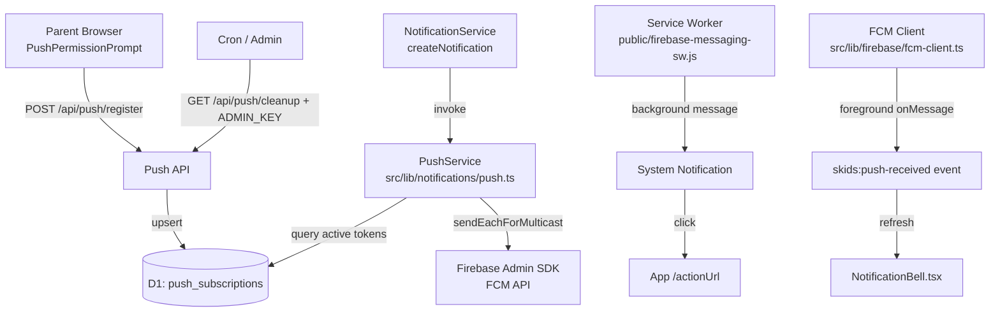

# Design Document: Push Notifications

## Overview

Push Notifications layers FCM (Firebase Cloud Messaging) device-level push delivery on top of the existing smart-notifications system. When `createNotification()` writes an in-app notification record, it also dispatches an FCM push to all registered devices for that parent. The PWA service worker handles background message receipt; a foreground client handler suppresses the system notification and instead refreshes the in-app bell.

Firebase is already integrated for auth — the FCM SDK (client) and Firebase Admin SDK (server) are available without new dependencies. The feature is fully opt-in: parents who deny permission or use unsupported browsers experience no degradation.

**Key design decisions:**

- `PushService` is a plain TypeScript module (same pattern as `NotificationService`) — no class, no DI.
- Token storage uses a new D1 table `push_subscriptions` with an `isActive` flag for soft-deletion.
- The FCM Admin SDK is initialised lazily from `FIREBASE_ADMIN_KEY` (already a Cloudflare secret) using a module-level singleton to avoid re-initialisation on every request.
- `blog_recommendation` pushes are suppressed unless the parent has been inactive for 3+ days, to avoid low-signal interruptions.
- The foreground client (`fcm-client.ts`) uses a module-level boolean guard to prevent duplicate `onMessage` listeners across React re-renders.

---

## Architecture



**Data flow summary:**

1. After onboarding completes, `PushPermissionPrompt` requests browser permission, calls `getToken()`, and POSTs to `/api/push/register`.
2. On every `createNotification()` call, `PushService.sendPush()` is invoked with the same title/body/actionUrl.
3. `PushService` queries active tokens for the parent, calls FCM `sendEachForMulticast`, and deactivates any `token-not-registered` tokens.
4. Background messages are handled by the service worker; foreground messages dispatch a custom DOM event that the bell listens to.

---

## Components and Interfaces

### PushService (`src/lib/notifications/push.ts`)

```typescript
export interface PushPayload {
  title: string
  body: string
  actionUrl: string
}

/**
 * Sends an FCM push to all active devices for a parent.
 * Called from createNotification() in service.ts.
 * Never throws — all errors are logged and swallowed.
 */
export async function sendPush(
  db: D1Database,
  env: Env,
  parentId: string,
  payload: PushPayload,
  notificationType: string
): Promise<void>

/**
 * Deactivates a single FCM token (token-not-registered or explicit unregister).
 */
export async function deactivateToken(
  db: D1Database,
  fcmToken: string,
  parentId: string
): Promise<void>

/**
 * Returns the Firebase Admin app instance, initialising it once from FIREBASE_ADMIN_KEY.
 */
function getAdminApp(env: Env): App  // module-private singleton
```

**Firebase Admin SDK initialisation pattern:**

```typescript
import { initializeApp, getApps, cert } from 'firebase-admin/app'
import { getMessaging } from 'firebase-admin/messaging'

let _app: App | null = null

function getAdminApp(env: Env): App {
  if (_app) return _app
  const serviceAccount = JSON.parse(env.FIREBASE_ADMIN_KEY)
  _app = initializeApp({ credential: cert(serviceAccount) })
  return _app
}
```

**FCM multicast send pattern:**

```typescript
const messaging = getMessaging(getAdminApp(env))
const response = await messaging.sendEachForMulticast({
  tokens: activeTokens,
  notification: { title: payload.title, body: payload.body },
  data: { actionUrl: payload.actionUrl },
  webpush: {
    notification: { icon: '/icons/icon-192.png' },
    fcmOptions: { link: payload.actionUrl },
  },
})
// Deactivate any token-not-registered failures
for (let i = 0; i < response.responses.length; i++) {
  const r = response.responses[i]
  if (!r.success && r.error?.code === 'messaging/registration-token-not-registered') {
    await deactivateToken(db, activeTokens[i], parentId)
  }
}
```

### API Routes

**`src/pages/api/push/register.ts`** — POST

```
POST /api/push/register
  Auth: Bearer <firebaseToken>
  Body: { fcmToken: string }
  → { success: true }

Behaviour: upsert push_subscriptions on (parentId, fcmToken).
  If record exists → update registeredAt, set isActive=true.
  If new → insert with isActive=true.
```

**`src/pages/api/push/unregister.ts`** — POST

```
POST /api/push/unregister
  Auth: Bearer <firebaseToken>
  Body: { fcmToken: string }
  → { success: true }

Behaviour: set isActive=false WHERE parentId=? AND fcmToken=?
```

**`src/pages/api/push/cleanup.ts`** — GET

```
GET /api/push/cleanup
  Auth: x-admin-key: <ADMIN_KEY>  (or Authorization: Bearer <ADMIN_KEY>)
  → { deactivated: number }

Behaviour: UPDATE push_subscriptions SET is_active=0
  WHERE registered_at < datetime('now', '-60 days')
```

### FCM Client (`src/lib/firebase/fcm-client.ts`)

```typescript
import { getMessaging, onMessage, getToken } from 'firebase/messaging'
import { getApp } from 'firebase/app'  // Firebase already initialised for auth

let _listenerRegistered = false

/**
 * Initialises the foreground FCM listener once per session.
 * Dispatches 'skids:push-received' CustomEvent with PushPayload on each message.
 * Safe to call multiple times — guard prevents duplicate listeners.
 */
export function initFcmForegroundListener(): void

/**
 * Requests an FCM registration token using the VAPID key.
 * Returns null if permission is not granted or FCM is unavailable.
 */
export async function getFcmToken(): Promise<string | null>
```

### PushPermissionPrompt (`src/components/common/PushPermissionPrompt.tsx`)

```typescript
interface Props {
  onboardingCompleted: boolean
  token: string  // Firebase auth token for API calls
}

export default function PushPermissionPrompt({ onboardingCompleted, token }: Props)
```

**Mount logic:**

1. If `!onboardingCompleted` → render nothing.
2. If `Notification.permission === 'denied'` → render nothing.
3. If `Notification.permission === 'granted'` → skip prompt, call `registerToken()` directly.
4. If `localStorage.getItem('push_permission_dismissed')` → render nothing.
5. Otherwise → show prompt with "Allow Notifications" / "Not Now" buttons.

**`registerToken()` flow:**

```typescript
async function registerToken() {
  try {
    const token = await getFcmToken()
    if (!token) return
    await fetch('/api/push/register', {
      method: 'POST',
      headers: { Authorization: `Bearer ${authToken}`, 'Content-Type': 'application/json' },
      body: JSON.stringify({ fcmToken: token }),
    })
    // Set up onTokenRefresh via getToken polling or messaging().onTokenRefresh
  } catch {
    // silently ignore — graceful degradation
  }
}
```

### Service Worker (`public/firebase-messaging-sw.js`)

Handles background FCM messages. Must be at the root of the public directory for service worker scope.

```javascript
importScripts('https://www.gstatic.com/firebasejs/10.x.x/firebase-app-compat.js')
importScripts('https://www.gstatic.com/firebasejs/10.x.x/firebase-messaging-compat.js')

firebase.initializeApp({ /* FCM config — public values only */ })
const messaging = firebase.messaging()

messaging.onBackgroundMessage((payload) => {
  const { title, body } = payload.notification ?? {}
  const actionUrl = payload.data?.actionUrl ?? '/dashboard'
  self.registration.showNotification(title ?? 'SKIDS', {
    body,
    icon: '/icons/icon-192.png',
    data: { actionUrl },
  })
})

self.addEventListener('notificationclick', (event) => {
  event.notification.close()
  const actionUrl = event.notification.data?.actionUrl ?? '/dashboard'
  event.waitUntil(
    clients.matchAll({ type: 'window', includeUncontrolled: true }).then((clientList) => {
      for (const client of clientList) {
        if (client.url.includes(self.location.origin) && 'focus' in client) {
          client.focus()
          client.navigate(actionUrl)
          return
        }
      }
      clients.openWindow(actionUrl)
    })
  )
})
```

### NotificationBell.tsx (updated)

Add a `useEffect` that listens for `skids:push-received` and re-fetches notifications:

```typescript
useEffect(() => {
  const handler = () => {
    // re-fetch notifications list
    fetchNotifications()
  }
  window.addEventListener('skids:push-received', handler)
  return () => window.removeEventListener('skids:push-received', handler)
}, [])
```

### NotificationService integration (`src/lib/notifications/service.ts`)

`createNotification()` gains a `sendPush` call after the DB insert:

```typescript
export async function createNotification(
  db: D1Database,
  env: Env,
  input: NotificationInput
): Promise<void> {
  // ... existing DB insert ...
  // Fire-and-forget push (never throws)
  sendPush(db, env, input.parentId, {
    title: input.title,
    body: input.body,
    actionUrl: input.actionUrl,
  }, input.type).catch(() => {})
}
```

---

## Data Models

### push_subscriptions table (new)

```sql
CREATE TABLE push_subscriptions (
  id           TEXT PRIMARY KEY,
  parent_id    TEXT NOT NULL REFERENCES parents(id),
  fcm_token    TEXT NOT NULL,
  user_agent   TEXT,
  registered_at TEXT NOT NULL DEFAULT (datetime('now')),
  is_active    INTEGER NOT NULL DEFAULT 1
);

CREATE UNIQUE INDEX idx_push_subscriptions_parent_token
  ON push_subscriptions(parent_id, fcm_token);

CREATE INDEX idx_push_subscriptions_parent_active
  ON push_subscriptions(parent_id, is_active);
```

### Drizzle schema entry (`src/lib/db/schema.ts`)

```typescript
export const pushSubscriptions = sqliteTable('push_subscriptions', {
  id: text('id').primaryKey().$defaultFn(() => crypto.randomUUID()),
  parentId: text('parent_id').notNull().references(() => parents.id),
  fcmToken: text('fcm_token').notNull(),
  userAgent: text('user_agent'),
  registeredAt: text('registered_at').default(sql`(datetime('now'))`),
  isActive: integer('is_active', { mode: 'boolean' }).default(true),
})
```

### PushPayload (runtime type)

```typescript
interface PushPayload {
  title: string   // same value as notifications.title
  body: string    // same value as notifications.body
  actionUrl: string  // same value as JSON.parse(notifications.data_json).actionUrl
}
```

### Migration file: `migrations/0005_push_subscriptions.sql`

```sql
-- Migration: 0005_push_subscriptions
-- Adds push_subscriptions table for FCM token storage

CREATE TABLE push_subscriptions (
  id            TEXT PRIMARY KEY,
  parent_id     TEXT NOT NULL REFERENCES parents(id),
  fcm_token     TEXT NOT NULL,
  user_agent    TEXT,
  registered_at TEXT NOT NULL DEFAULT (datetime('now')),
  is_active     INTEGER NOT NULL DEFAULT 1
);

CREATE UNIQUE INDEX idx_push_subscriptions_parent_token
  ON push_subscriptions(parent_id, fcm_token);

CREATE INDEX idx_push_subscriptions_parent_active
  ON push_subscriptions(parent_id, is_active);
```

---

## Correctness Properties

*A property is a characteristic or behavior that should hold true across all valid executions of a system — essentially, a formal statement about what the system should do. Properties serve as the bridge between human-readable specifications and machine-verifiable correctness guarantees.*

### Property 1: Token registration is idempotent

*For any* parentId and FCMToken, calling `/api/push/register` N times should result in exactly 1 `push_subscriptions` record with that (parentId, fcmToken) pair, with `isActive = true`.

**Validates: Requirements 1.2, 1.3**

---

### Property 2: Token ownership isolation

*For any* authenticated parentId, all `push_subscriptions` records returned or modified by the Push API should have `parentId` equal to the authenticated parent — no cross-parent access is possible.

**Validates: Requirements 3.5**

---

### Property 3: Unregister deactivates token

*For any* registered (parentId, fcmToken) pair, calling `/api/push/unregister` should result in `isActive = false` on that record, and the record should still exist (soft delete).

**Validates: Requirements 3.3**

---

### Property 4: PushService sends to exactly the active subscription set

*For any* parentId with a mix of active and inactive `push_subscriptions` records, `sendPush()` should invoke the FCM API with exactly the tokens where `isActive = true` — no inactive tokens, no omitted active tokens.

**Validates: Requirements 4.2, 4.3**

---

### Property 5: Push payload matches notification record

*For any* `NotificationInput`, the `PushPayload` constructed by `PushService` should have `title`, `body`, and `actionUrl` fields that exactly equal the `title`, `body`, and `actionUrl` values written to the `notifications` table for the same input.

**Validates: Requirements 8.1, 8.2**

---

### Property 6: blog_recommendation push suppression

*For any* `blog_recommendation` notification where the parent has a `content_engagement` or session record within the last 3 days, `sendPush()` should not call the FCM API.

**Validates: Requirements 8.4**

---

### Property 7: Cleanup deactivates only stale tokens

*For any* set of `push_subscriptions` records, calling `/api/push/cleanup` should set `isActive = false` on all records where `registeredAt < now - 60 days`, and leave all records where `registeredAt >= now - 60 days` unchanged.

**Validates: Requirements 9.3**

---

### Property 8: Unauthenticated push API requests return 401

*For any* request to `/api/push/register` or `/api/push/unregister` without a valid Firebase auth token, and any request to `/api/push/cleanup` without a valid `ADMIN_KEY`, the response status should be 401.

**Validates: Requirements 1.4, 3.4, 9.4**

---

### Property 9: Foreground listener is registered at most once

*For any* number of calls to `initFcmForegroundListener()`, exactly one `onMessage` listener should be active — calling it N times should not result in N events dispatched per incoming message.

**Validates: Requirements 6.3**

---

### Property 10: Service worker notification uses payload title

*For any* FCM background message payload, the system notification displayed by the service worker should have a `title` field that exactly matches `payload.notification.title` from the FCM message.

**Validates: Requirements 5.4, 8.3**

---

## Error Handling

- **FCM token-not-registered**: `PushService` catches this specific error code per token, calls `deactivateToken()`, and continues to remaining tokens. The in-app notification is unaffected.
- **FCM API unavailable / timeout**: `sendPush()` wraps the entire FCM call in a `try/catch`. Any non-token error is logged (`console.error`) and swallowed. `createNotification()` always completes.
- **No active subscriptions**: `sendPush()` queries active tokens first; if the result is empty it returns immediately without calling the FCM API.
- **Firebase Admin SDK init failure**: If `FIREBASE_ADMIN_KEY` is malformed or missing, `getAdminApp()` throws. This is caught by `sendPush()`'s outer try/catch — the push is silently skipped.
- **Client-side FCM init failure**: `getFcmToken()` wraps `getToken()` in try/catch and returns `null`. `PushPermissionPrompt` checks for null and skips registration silently.
- **Browser Notifications API unavailable**: `PushPermissionPrompt` checks `typeof Notification !== 'undefined'` before any permission request. If absent, the component renders nothing.
- **API auth errors**: All three push API routes use the standard `getParentId` pattern. Missing/invalid token → 401. `/api/push/cleanup` checks `request.headers.get('x-admin-key') === env.ADMIN_KEY`.
- **Service worker actionUrl missing**: Defaults to `/dashboard` if `payload.data?.actionUrl` is absent.

---

## Testing Strategy

### Unit Tests (Vitest)

Focus on pure logic and API route handlers:

- `deactivateToken` — mock DB, verify correct UPDATE is issued.
- `sendPush` with no active tokens — verify FCM API is never called.
- `sendPush` with mixed active/inactive tokens — verify only active tokens are passed to FCM.
- `sendPush` blog_recommendation suppression — mock recent activity, verify FCM not called.
- `sendPush` token-not-registered handling — mock FCM response with one failure, verify `deactivateToken` called for that token and others still processed.
- API route handlers — mock `env.DB` and `env.FIREBASE_ADMIN_KEY`, verify 401 on missing auth, 200 on valid requests.
- `initFcmForegroundListener` — call twice, verify only one listener registered.
- Service worker `notificationclick` handler — verify `actionUrl` fallback to `/dashboard`.

### Property-Based Tests (fast-check, minimum 100 runs each)

Each property from the Correctness Properties section maps to one property-based test.

**Tag format**: `Feature: push-notifications, Property N: <property_text>`

- **Property 1** — Generate random (parentId, fcmToken) pairs. Call register endpoint N times (N ∈ [1, 10]). Assert exactly 1 record with isActive=true.
  `// Feature: push-notifications, Property 1: Token registration is idempotent`

- **Property 2** — Generate two random parentIds and a token. Register token under parentA. Assert parentB cannot query or modify it.
  `// Feature: push-notifications, Property 2: Token ownership isolation`

- **Property 3** — Generate random (parentId, fcmToken). Register then unregister. Assert record exists with isActive=false.
  `// Feature: push-notifications, Property 3: Unregister deactivates token`

- **Property 4** — Generate random sets of active/inactive subscriptions for a parentId. Call sendPush. Assert FCM multicast tokens list equals exactly the active subset.
  `// Feature: push-notifications, Property 4: PushService sends to exactly the active subscription set`

- **Property 5** — Generate random NotificationInput values. Assert PushPayload fields equal the corresponding notification record fields.
  `// Feature: push-notifications, Property 5: Push payload matches notification record`

- **Property 6** — Generate random blog_recommendation inputs with recent activity timestamps. Assert FCM API is not called.
  `// Feature: push-notifications, Property 6: blog_recommendation push suppression`

- **Property 7** — Generate random sets of subscriptions with varying registeredAt dates. Call cleanup. Assert only records older than 60 days are deactivated.
  `// Feature: push-notifications, Property 7: Cleanup deactivates only stale tokens`

- **Property 8** — Generate random requests without auth headers. Assert all three endpoints return 401.
  `// Feature: push-notifications, Property 8: Unauthenticated push API requests return 401`

- **Property 9** — Call initFcmForegroundListener N times (N ∈ [1, 20]). Dispatch one FCM message. Assert exactly 1 skids:push-received event is fired.
  `// Feature: push-notifications, Property 9: Foreground listener is registered at most once`

- **Property 10** — Generate random FCM message payloads. Assert service worker showNotification title equals payload.notification.title.
  `// Feature: push-notifications, Property 10: Service worker notification uses payload title`

Both unit and property tests run via `vitest --run`. D1 is mocked with an in-memory object mock. The FCM Admin SDK is mocked via `vi.mock('firebase-admin/messaging')`.
