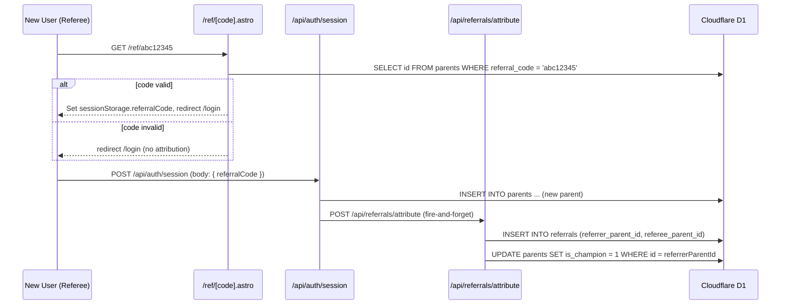
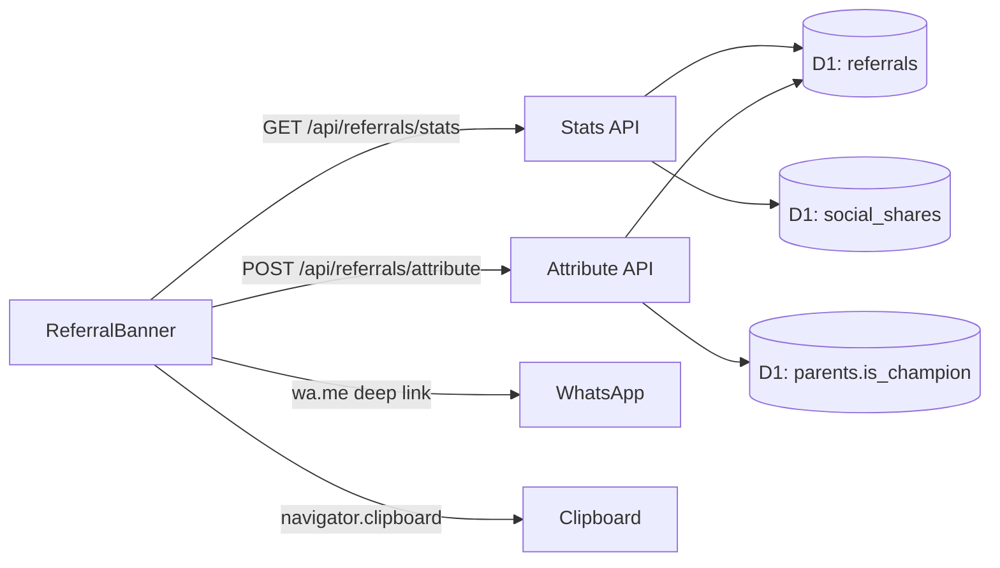

# Design Document: Referral System

## Overview

The Referral System enables authenticated parents on `parent.skids.clinic` to share a unique referral link, attribute new signups to referrers, and reward referrers with a "SKIDS Champion" badge. WhatsApp is the primary sharing channel given the Indian context. This is an MVP — no monetary rewards, no tiered incentives.

The system touches four layers:

1. **Database** — new `referrals` table + `is_champion` / `referral_code` columns on `parents`
2. **Server** — two API routes (`POST /api/referrals/attribute`, `GET /api/referrals/stats`) + attribution hook in the session API
3. **Landing page** — `src/pages/ref/[code].astro` validates the code and seeds `sessionStorage`
4. **UI** — `ReferralBanner.tsx` wired to real API; `UserProfile.tsx` shows the Champion badge

---

## Architecture





---

## Components and Interfaces

### Landing Page — `src/pages/ref/[code].astro`

Server-rendered Astro page (SSR). On request:

1. Extract `code` from `Astro.params.code`
2. Query D1: `SELECT id FROM parents WHERE referral_code = ?`
3. If found → set a `Set-Cookie` header with `referralCode=<code>; Path=/; SameSite=Lax; Max-Age=3600` **and** return an HTML page that writes `sessionStorage.setItem('referralCode', code)` then `location.href = '/login'`
4. If not found → redirect to `/login` with no cookie/storage write

> Using both a short-lived cookie and sessionStorage ensures the code survives the redirect even in browsers that block cross-origin sessionStorage writes.

### API Route — `POST /api/referrals/attribute`

**File:** `src/pages/api/referrals/attribute.ts`

Request body:
```typescript
{ referralCode: string, refereeParentId: string }
```

Response:
```typescript
// 200
{ ok: true, isNewChampion: boolean }
// 404 — referral code not found
{ error: 'Referral code not found' }
// 409 — referee already attributed
{ error: 'Already attributed' }
// 401 — unauthenticated
{ error: 'Unauthorized' }
```

Logic:
1. Authenticate caller via `getParentId` — must match `refereeParentId`
2. Look up referrer: `SELECT id FROM parents WHERE referral_code = ?`
3. If not found → 404
4. Insert into `referrals` (unique constraint on `referee_parent_id` catches duplicates → 409)
5. `UPDATE parents SET is_champion = 1 WHERE id = referrerParentId AND is_champion = 0` — returns `isNewChampion` based on `changes`

### API Route — `GET /api/referrals/stats`

**File:** `src/pages/api/referrals/stats.ts`

Response:
```typescript
{
  referralCode: string,
  referralLink: string,       // https://parent.skids.clinic/ref/<code>
  signupCount: number,        // rows in referrals WHERE referrer_parent_id = parentId
  shareCount: number,         // rows in social_shares WHERE parent_id = parentId AND content_type = 'referral'
  isChampion: boolean
}
```

Logic:
1. Authenticate via `getParentId` → 401 if missing
2. `SELECT referral_code, is_champion FROM parents WHERE id = ?`
3. `SELECT COUNT(*) FROM referrals WHERE referrer_parent_id = ?`
4. `SELECT COUNT(*) FROM social_shares WHERE parent_id = ? AND content_type = 'referral'`
5. Construct `referralLink` server-side

### Session API Hook — `src/pages/api/auth/session.ts`

After a new parent record is inserted (`isNew = true`), read `referralCode` from the request body and fire-and-forget to `POST /api/referrals/attribute`:

```typescript
if (isNew) {
  const body = await request.json().catch(() => ({}))
  const referralCode = body?.referralCode
  if (referralCode) {
    fetch(`${origin}/api/referrals/attribute`, {
      method: 'POST',
      headers: {
        'Content-Type': 'application/json',
        Authorization: `Bearer ${token}`,
      },
      body: JSON.stringify({ referralCode, refereeParentId: parentId }),
    }).catch(() => {})
  }
}
```

The client (`LoginForm.tsx`) reads `sessionStorage.getItem('referralCode')` and includes it in the session POST body.

### Component — `ReferralBanner.tsx`

Replaces the current client-side-only implementation with a real API-backed version.

State:
```typescript
{
  referralCode: string | null
  referralLink: string | null
  signupCount: number
  shareCount: number
  isChampion: boolean
  copied: boolean
  loading: boolean
}
```

On mount: `GET /api/referrals/stats` with Bearer token → populate state.

Share recording: both Copy and WhatsApp buttons call `POST /api/social-shares` (existing pattern) with `content_type: 'referral'`, `content_id: referralCode`, `utm_campaign: 'skids_referral'`.

Champion badge: rendered above the share UI when `isChampion === true`.

### Component — `UserProfile.tsx`

No structural changes needed — `ReferralBanner` already renders inside `UserProfile`. The Champion badge is rendered within `ReferralBanner` itself when `isChampion` is true, keeping the badge co-located with the referral context.

---

## Data Models

### Schema changes — `src/lib/db/schema.ts`

Add two columns to the `parents` table:

```typescript
referralCode: text('referral_code').unique(),
isChampion: integer('is_champion', { mode: 'boolean' }).default(false),
```

New `referrals` table:

```typescript
export const referrals = sqliteTable('referrals', {
  id: text('id').primaryKey().$defaultFn(() => crypto.randomUUID()),
  referrerParentId: text('referrer_parent_id').notNull().references(() => parents.id),
  refereeParentId: text('referee_parent_id').notNull().unique().references(() => parents.id),
  createdAt: text('created_at').default(sql`(datetime('now'))`),
})
```

The `UNIQUE` constraint on `referee_parent_id` is the database-level enforcement of at-most-one attribution.

The `social_shares` table already has a `content_type` enum. We need to add `'referral'` to the enum values:

```typescript
contentType: text('content_type', {
  enum: ['blog', 'organ', 'habit', 'milestone', 'growth', 'intervention', 'referral'],
}).notNull(),
```

### Migration — `migrations/0006_referral_system.sql`

```sql
-- Add referral columns to parents
ALTER TABLE parents ADD COLUMN referral_code TEXT UNIQUE;
ALTER TABLE parents ADD COLUMN is_champion INTEGER NOT NULL DEFAULT 0;

-- Referrals attribution table
CREATE TABLE IF NOT EXISTS referrals (
  id TEXT PRIMARY KEY,
  referrer_parent_id TEXT NOT NULL REFERENCES parents(id),
  referee_parent_id TEXT NOT NULL UNIQUE REFERENCES parents(id),
  created_at TEXT DEFAULT (datetime('now'))
);

CREATE INDEX IF NOT EXISTS idx_referrals_referrer ON referrals(referrer_parent_id);
```

### Referral Code Generation

Codes are generated deterministically from the parent's Firebase UID using the first 8 characters of the SHA-256 hash encoded in base36.

```typescript
// src/lib/referral/generateCode.ts
export async function generateReferralCode(firebaseUid: string): Promise<string> {
  const encoder = new TextEncoder()
  const data = encoder.encode(firebaseUid)
  const hashBuffer = await crypto.subtle.digest('SHA-256', data)
  const hashArray = new Uint8Array(hashBuffer)
  // Take first 5 bytes → up to 10 base36 chars, slice to 8
  const num = hashArray.slice(0, 5).reduce((acc, byte) => acc * 256n + BigInt(byte), 0n)
  return num.toString(36).padStart(8, '0').slice(0, 8)
}
```

This is called in `session.ts` when `isNew = true` and `referral_code` is null:

```typescript
const code = await generateReferralCode(decoded.uid)
await db.prepare('UPDATE parents SET referral_code = ? WHERE id = ? AND referral_code IS NULL')
  .bind(code, parentId).run()
```

The `AND referral_code IS NULL` guard makes the update idempotent — existing codes are never overwritten.

**Collision analysis:** 5 bytes → 2^40 ≈ 1 trillion possible values. At 10,000 parents the birthday-paradox collision probability is ~4.5×10⁻⁶. Acceptable for MVP; the DB unique constraint is the safety net.

### UTM Link Construction

```typescript
// src/lib/referral/buildLink.ts
export function buildReferralLink(code: string, medium: 'whatsapp' | 'copy'): string {
  const url = new URL(`https://parent.skids.clinic/ref/${code}`)
  url.searchParams.set('utm_source', 'referral')
  url.searchParams.set('utm_medium', medium)
  url.searchParams.set('utm_campaign', 'skids_referral')
  return url.toString()
}
```

The base referral link (`/ref/<code>`) is stored and displayed; UTM params are appended at share time so the displayed link stays clean.

---

## Correctness Properties

*A property is a characteristic or behavior that should hold true across all valid executions of a system — essentially, a formal statement about what the system should do. Properties serve as the bridge between human-readable specifications and machine-verifiable correctness guarantees.*

### Property 1: Referral code format

*For any* Firebase UID string, `generateReferralCode` must return a string of exactly 8 characters, each of which is a lowercase alphanumeric character (`[0-9a-z]`).

**Validates: Requirements 1.1**

---

### Property 2: Referral code uniqueness

*For any* set of distinct Firebase UIDs, the set of generated referral codes must contain no duplicates.

**Validates: Requirements 1.2**

---

### Property 3: Referral code determinism and idempotence

*For any* Firebase UID, calling `generateReferralCode` any number of times must always return the same code. Equivalently, the session upsert with `AND referral_code IS NULL` must leave an already-set code unchanged.

**Validates: Requirements 1.3, 1.4**

---

### Property 4: UTM link construction correctness

*For any* valid referral code and share medium (`whatsapp` | `copy`), `buildReferralLink` must return a URL whose path is `/ref/<code>`, `utm_source` is `referral`, `utm_medium` matches the supplied medium, and `utm_campaign` starts with `skids_`.

**Validates: Requirements 2.1, 2.2, 2.3**

---

### Property 5: Attribution round-trip

*For any* valid referral code and new referee parent ID, calling `POST /api/referrals/attribute` must result in a row existing in the `referrals` table with the correct `referrer_parent_id` and `referee_parent_id`.

**Validates: Requirements 3.4, 7.1**

---

### Property 6: At-most-once attribution

*For any* referee parent ID, calling `POST /api/referrals/attribute` more than once must result in exactly one row in `referrals` for that referee, and subsequent calls must return HTTP 409.

**Validates: Requirements 3.5, 7.5, 8.2**

---

### Property 7: Champion status set on first attribution

*For any* referrer who does not yet hold `isChampion`, when their first referee completes attribution, the referrer's `is_champion` column must be set to `1` (true).

**Validates: Requirements 3.6, 6.1**

---

### Property 8: Champion status permanence

*For any* parent with `is_champion = 1`, deleting or modifying the corresponding `referrals` row must not change `is_champion` back to `0`. The champion flag is write-once.

**Validates: Requirements 6.4**

---

### Property 9: Stats accuracy

*For any* parent with a known set of referral rows and share rows, `GET /api/referrals/stats` must return `signupCount` equal to the number of `referrals` rows where `referrer_parent_id` matches, and `shareCount` equal to the number of `social_shares` rows where `parent_id` matches and `content_type = 'referral'`.

**Validates: Requirements 4.1, 4.2, 7.3**

---

### Property 10: Share event recording

*For any* authenticated parent who triggers a share action (WhatsApp or copy), a row must be inserted into `social_shares` with the correct `platform`, `content_type = 'referral'`, `content_id = referralCode`, and `utm_campaign = 'skids_referral'`.

**Validates: Requirements 5.6, 5.7**

---

### Property 11: WhatsApp message contains correct UTM link

*For any* referral code, the WhatsApp share message string must contain the referral link with `utm_medium=whatsapp` and `utm_campaign=skids_referral`.

**Validates: Requirements 5.5**

---

## Error Handling

| Scenario | Behaviour |
|---|---|
| Invalid referral code on landing page | Redirect to `/login` with no sessionStorage write; no error shown to user |
| `POST /api/referrals/attribute` — unknown code | HTTP 404 `{ error: 'Referral code not found' }` |
| `POST /api/referrals/attribute` — duplicate referee | HTTP 409 `{ error: 'Already attributed' }` — idempotent, not a user-visible error |
| `POST /api/referrals/attribute` — unauthenticated | HTTP 401 |
| `GET /api/referrals/stats` — unauthenticated | HTTP 401 |
| `GET /api/referrals/stats` — parent has no referral code yet | Generate and persist code on-the-fly, return it |
| Clipboard API unavailable | Fall back to `document.execCommand('copy')` |
| Attribution fire-and-forget fails | Silent failure — referral is not attributed; acceptable for MVP (no retry mechanism) |
| DB unique constraint violation on `referral_code` | Extremely unlikely (collision probability ~4.5×10⁻⁶ at 10k users); log and surface as 500 |

---

## Testing Strategy

### Dual Testing Approach

Both unit tests and property-based tests are required. Unit tests cover specific examples, integration points, and error conditions. Property tests verify universal correctness across randomised inputs.

### Property-Based Testing

**Library:** `fast-check` (TypeScript, works in Vitest)

Each property test runs a minimum of **100 iterations**. Each test is tagged with a comment referencing the design property.

Tag format: `// Feature: referral-system, Property <N>: <property_text>`

| Design Property | Test file | fast-check arbitraries |
|---|---|---|
| P1: Code format | `src/lib/referral/generateCode.test.ts` | `fc.string()` for UIDs |
| P2: Code uniqueness | `src/lib/referral/generateCode.test.ts` | `fc.uniqueArray(fc.string(), { minLength: 2, maxLength: 500 })` |
| P3: Code determinism | `src/lib/referral/generateCode.test.ts` | `fc.string()` |
| P4: UTM link construction | `src/lib/referral/buildLink.test.ts` | `fc.string({ minLength: 8, maxLength: 8 })`, `fc.constantFrom('whatsapp', 'copy')` |
| P5: Attribution round-trip | `src/pages/api/referrals/attribute.test.ts` | `fc.uuid()` for parent IDs, `fc.string()` for codes |
| P6: At-most-once attribution | `src/pages/api/referrals/attribute.test.ts` | `fc.uuid()` |
| P7: Champion on first attribution | `src/pages/api/referrals/attribute.test.ts` | `fc.uuid()` |
| P8: Champion permanence | `src/lib/db/referrals.test.ts` | `fc.uuid()` |
| P9: Stats accuracy | `src/pages/api/referrals/stats.test.ts` | `fc.integer({ min: 0, max: 50 })` for row counts |
| P10: Share recording | `src/pages/api/referrals/attribute.test.ts` | `fc.constantFrom('whatsapp', 'copy')` |
| P11: WhatsApp message content | `src/lib/referral/buildLink.test.ts` | `fc.string({ minLength: 8, maxLength: 8 })` |

### Unit / Integration Tests

- `GET /api/referrals/stats` returns HTTP 401 for unauthenticated requests
- `POST /api/referrals/attribute` returns HTTP 401 for unauthenticated requests
- `POST /api/referrals/attribute` returns HTTP 404 for unknown referral code
- Landing page `/ref/[code]` redirects to `/login` for invalid code without setting sessionStorage
- Landing page `/ref/[code]` sets sessionStorage and redirects for valid code
- `ReferralBanner` renders null when user is not authenticated
- Migration `0006_referral_system.sql` runs without error and creates expected columns/table

### Test Configuration

```typescript
// vitest.config.ts — no changes needed; fast-check works with Vitest out of the box
// Run with: npx vitest --run
```

Example property test skeleton:

```typescript
import { describe, it, expect } from 'vitest'
import * as fc from 'fast-check'
import { generateReferralCode } from '@/lib/referral/generateCode'

describe('generateReferralCode', () => {
  it('P1: always returns 8 lowercase alphanumeric characters', async () => {
    // Feature: referral-system, Property 1: code format
    await fc.assert(
      fc.asyncProperty(fc.string({ minLength: 1 }), async (uid) => {
        const code = await generateReferralCode(uid)
        expect(code).toMatch(/^[0-9a-z]{8}$/)
      }),
      { numRuns: 100 }
    )
  })
})
```
