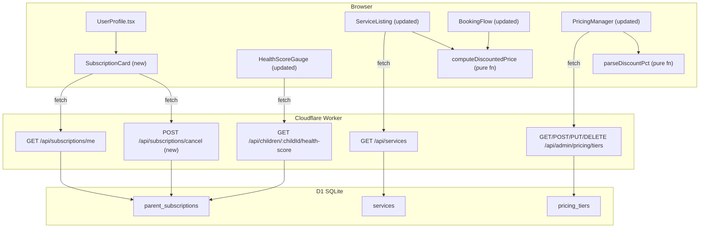
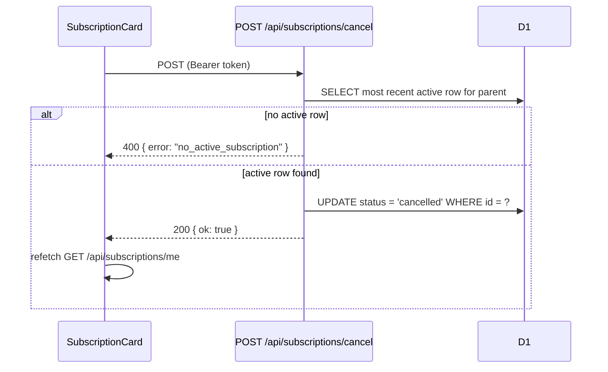
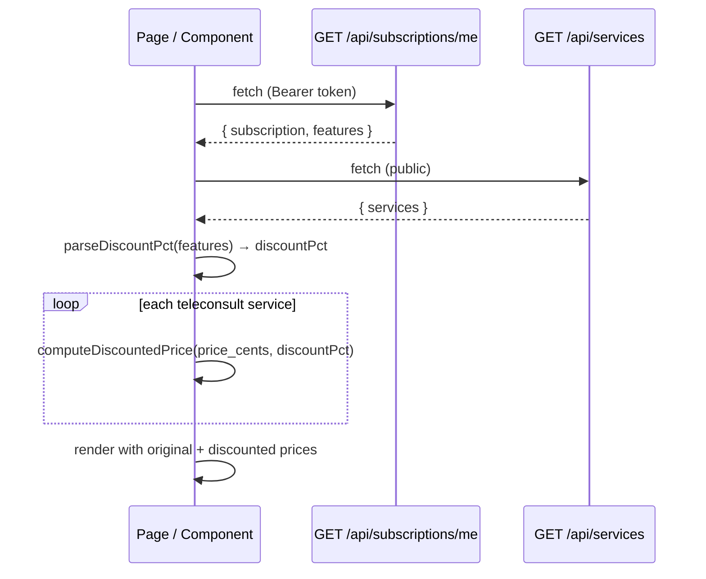

# Design Document: subscription-features-ui

## Overview

This feature adds three user-facing capabilities on top of the existing `growth-monetisation` pricing infrastructure:

1. **Subscription Management UI** — A `SubscriptionCard` component inside `UserProfile.tsx` lets parents view their current plan (tier name, billing cycle, expiry, feature list) and cancel it. A new `POST /api/subscriptions/cancel` endpoint handles the status transition.
2. **Health Score Detailed View** — `HealthScoreGauge` gains a `features` prop. When `health_score_detailed` is present, it expands to show per-component bars (growth, development, habits, nutrition) alongside the composite ring.
3. **Teleconsult Discount** — A pure `computeDiscountedPrice` function drives discounted price display on service listings and in the booking flow. The discount percentage is stored as `"teleconsult_discount_pct:N"` in `features_json`. `PricingManager` gains a numeric input for this value.

Stack: Astro 5 + React + Cloudflare Workers + D1 SQLite + Drizzle ORM + Firebase Auth. All server code runs in the Workers runtime (no Node.js-only APIs). Tests use Vitest + fast-check (383 tests currently passing).

---

## Architecture



### Key Design Decisions

- **Cancel is a dedicated endpoint**: `POST /api/subscriptions/cancel` rather than `PATCH /api/subscriptions/:id` keeps the parent-facing API simple and avoids exposing subscription IDs to the client.
- **`computeDiscountedPrice` is a pure function**: No I/O, no side effects. Lives in `src/lib/pricing/discount.ts`. Both the service listing and booking flow import it directly, making it trivially testable.
- **`parseDiscountPct` is also pure**: Extracts the integer N from `"teleconsult_discount_pct:N"`. Returns `null` for malformed strings, `0` when the feature key is absent.
- **`HealthScoreGauge` receives `features` as a prop**: The parent component (`ChildDashboard`) already has the features array from `GET /api/subscriptions/me`. Passing it as a prop avoids a second fetch inside the gauge.
- **PricingManager stores the full feature key string**: The admin enters a number (0–100); the form serialises it as `"teleconsult_discount_pct:N"` before saving. This keeps the DB format consistent with the existing `features_json` array-of-strings convention.

---

## Components and Interfaces

### 1. `POST /api/subscriptions/cancel`

New file: `src/pages/api/subscriptions/cancel.ts`

```
POST /api/subscriptions/cancel
Authorization: Bearer <firebase-token>
→ 200 { "ok": true }
→ 400 { "error": "no_active_subscription" }
→ 401 { "error": "Unauthorized" }
```

Logic:
1. Authenticate via `getParentId(request, env)`.
2. Query the most recent `active` row for the parent (`ORDER BY created_at DESC LIMIT 1`).
3. If none found → 400.
4. `UPDATE parent_subscriptions SET status = 'cancelled' WHERE id = ?` (only the status column).
5. Return 200 `{ ok: true }`.

The endpoint never touches `expired` or `cancelled` rows — the `WHERE status = 'active'` clause in step 2 ensures this.

### 2. `SubscriptionCard` component

New file: `src/components/subscription/SubscriptionCard.tsx`

```typescript
interface Props {
  token: string
}
```

States: `loading` → skeleton; `error` → error banner + retry button; `loaded` → plan display.

Loaded state renders:
- Tier name (or "Free Plan" if `subscription === null`)
- Billing cycle badge (`monthly` / `yearly`)
- Expiry date formatted as `DD MMM YYYY` (or "—" if null)
- Feature list as pill badges (human-readable labels from a `FEATURE_LABELS` map)
- "Cancel Plan" button — only when `subscription !== null && subscription.status === 'active'`

Cancel flow:
1. Click "Cancel Plan" → show inline confirmation (`"Are you sure? Your plan stays active until expiry."`)
2. Confirm → call `POST /api/subscriptions/cancel` → on success, refetch subscription data.
3. On API error → show inline error message.

Integrated into `UserProfile.tsx` between the profile card and the children section, rendered only when `token` is available.

### 3. `HealthScoreGauge` — updated props

Updated file: `src/components/phr/HealthScoreGauge.tsx`

```typescript
interface Props {
  childId: string
  token: string
  features?: string[]   // new optional prop; defaults to []
}
```

Behaviour:
- If `features` includes `'health_score_detailed'` AND `data.components` has at least one key → render **Detailed View** below the existing ring.
- Otherwise → existing composite ring only (no change to current rendering).

Detailed View renders a list of component bars for each key present in `data.components`:

```typescript
const COMPONENT_LABELS: Record<string, string> = {
  growth: 'Growth',
  development: 'Development',
  habits: 'Habits',
  nutrition: 'Nutrition',
}
```

Each bar:
- Label (from `COMPONENT_LABELS`)
- Filled progress bar (width = `score%`)
- Numeric score
- Color class from `getScoreColor(score)` → same red/amber/green mapping as the composite ring
- `aria-label` attribute: `"${label} score: ${score} out of 100"`

### 4. `computeDiscountedPrice` and `parseDiscountPct`

New file: `src/lib/pricing/discount.ts`

```typescript
/**
 * Computes the discounted price in cents.
 * discountPct must be in [0, 100].
 * Returns floor(priceCents * (1 - discountPct / 100)).
 * Result is always in [0, priceCents].
 */
export function computeDiscountedPrice(priceCents: number, discountPct: number): number {
  return Math.floor(priceCents * (1 - discountPct / 100))
}

/**
 * Parses the discount percentage from a features array.
 * Looks for an entry matching "teleconsult_discount_pct:N".
 * Returns N as an integer, or 0 if not found or malformed.
 */
export function parseDiscountPct(features: string[]): number {
  for (const f of features) {
    const m = f.match(/^teleconsult_discount_pct:(\d+)$/)
    if (m) {
      const n = parseInt(m[1], 10)
      return n >= 0 && n <= 100 ? n : 0
    }
  }
  return 0
}

/**
 * Serialises a discount percentage to the feature key string format.
 * N must be an integer in [0, 100].
 */
export function serializeDiscountPct(n: number): string {
  return `teleconsult_discount_pct:${Math.round(n)}`
}
```

### 5. Service listing discount display

The existing service listing component (wherever teleconsult services are rendered) receives the parent's `features` array as a prop. For each service where `delivery_type = 'telehealth'` or `category = 'consultation'`:

```typescript
const discountPct = parseDiscountPct(features)
const discountedPrice = computeDiscountedPrice(service.price_cents, discountPct)
const hasDiscount = discountPct > 0
```

Render:
- `hasDiscount = false` → show original price only
- `hasDiscount = true` → show original price with strikethrough + discounted price highlighted in green

### 6. `PricingManager` — teleconsult discount input

Updated file: `src/components/admin/PricingManager.tsx`

The `TierForm` component gains a numeric input for the teleconsult discount percentage. It appears when `teleconsult_discount_pct` is checked in the features checklist.

```typescript
// In TierForm state, alongside features[]
const [discountPct, setDiscountPct] = useState<number>(
  parseDiscountPctFromFeatures(initial.features)
)
```

On save, `handleSave` replaces any existing `teleconsult_discount_pct:*` entry in the features array with `serializeDiscountPct(discountPct)` before sending to the API.

Validation: if `teleconsult_discount_pct` is checked and `discountPct` is not in [0, 100], show inline error `"Discount must be between 0 and 100"` and block save.

---

## Data Models

No new DB tables or migrations are required. All changes use existing tables.

### `parent_subscriptions` (existing)

The cancel endpoint performs a targeted `UPDATE`:

```sql
UPDATE parent_subscriptions
SET status = 'cancelled'
WHERE id = ?
  AND parent_id = ?
  AND status = 'active'
```

Only `status` is written. All other columns (`features_snapshot_json`, `expires_at`, `billing_cycle`, `payment_id`, `started_at`) are untouched.

### `pricing_tiers.features_json` (existing)

The `teleconsult_discount_pct` value is stored as one element of the JSON array:

```json
["health_score_detailed", "teleconsult_discount_pct:20", "pdf_export"]
```

No schema change needed — the format is already a `TEXT` column storing a JSON array of strings.

### Data flow: subscription cancel



### Data flow: discount display



---

## Correctness Properties

*A property is a characteristic or behavior that should hold true across all valid executions of a system — essentially, a formal statement about what the system should do. Properties serve as the bridge between human-readable specifications and machine-verifiable correctness guarantees.*

### Property 1: Cancel column isolation

*For any* `parent_subscriptions` row with `status = 'active'`, after a successful call to `POST /api/subscriptions/cancel`, the row's `status` SHALL equal `'cancelled'` and every other column (`features_snapshot_json`, `expires_at`, `billing_cycle`, `payment_id`, `started_at`, `tier_id`, `parent_id`) SHALL be byte-for-byte identical to its value before the call. Furthermore, for any row with `status` already equal to `'expired'` or `'cancelled'`, the cancel endpoint SHALL return a 400 error and leave the row completely unchanged.

**Validates: Requirements 3.1, 3.2, 9.1**

### Property 2: Feature gate determinism

*For any* string array `features`, the `HealthScoreGauge` component SHALL render in Detailed View mode if and only if `features.includes('health_score_detailed')` is true. The rendering decision is a pure function of the `features` prop — no other state affects it.

**Validates: Requirements 4.1, 4.2, 9.2**

### Property 3: Component rendering completeness

*For any* `components` object returned by `GET /api/children/:childId/health-score`, when rendered in Detailed View mode, the output SHALL contain a labelled entry for every key present in `components` and SHALL NOT contain any entry for keys absent from `components`. The set of rendered component labels equals exactly the set of keys in `components`.

**Validates: Requirements 4.4, 5.1, 5.2**

### Property 4: Discount config round-trip

*For any* integer N in [0, 100], `parseDiscountPct([serializeDiscountPct(N)])` SHALL return N. Equivalently, serialising a valid discount percentage to the `"teleconsult_discount_pct:N"` string format and then parsing it back SHALL produce the original integer.

**Validates: Requirements 6.2, 6.3, 9.5**

### Property 5: Discount computation bounds and identity

*For any* integer `priceCents` ≥ 0 and integer `discountPct` in [0, 100], `computeDiscountedPrice(priceCents, discountPct)` SHALL satisfy:
- `0 ≤ result ≤ priceCents` (bounds)
- `computeDiscountedPrice(priceCents, 0) === priceCents` (identity: zero discount leaves price unchanged)
- `computeDiscountedPrice(priceCents, 100) === 0` (annihilation: full discount zeroes the price)

**Validates: Requirements 7.3, 9.3, 9.4**

---

## Error Handling

| Scenario | Behaviour |
|---|---|
| `POST /api/subscriptions/cancel` — unauthenticated | 401 `{ "error": "Unauthorized" }` |
| `POST /api/subscriptions/cancel` — no active subscription | 400 `{ "error": "no_active_subscription" }` |
| `POST /api/subscriptions/cancel` — DB error | 500 `{ "error": "Internal server error" }` |
| `SubscriptionCard` — fetch fails | Show error banner with retry button; do not show stale data |
| `SubscriptionCard` — cancel API error | Show inline error below the cancel button; keep button enabled for retry |
| `HealthScoreGauge` — `features` prop absent | Default to `[]`; render composite view only |
| `parseDiscountPct` — malformed entry (e.g. `"teleconsult_discount_pct:abc"`) | Return 0 (no discount) |
| `parseDiscountPct` — N outside [0, 100] | Return 0 (treat as no discount) |
| `PricingManager` — discount input outside [0, 100] | Inline validation error; block save |
| `computeDiscountedPrice` — called with `discountPct = 0` | Returns `priceCents` unchanged (no discount UI shown) |

---

## Testing Strategy

### Dual Testing Approach

Both unit tests and property-based tests are required. Unit tests cover specific examples, integration points, and error conditions. Property tests verify universal correctness across randomised inputs. Together they provide comprehensive coverage.

### Property-Based Testing

Library: **fast-check** (already in `package.json`).

Each property test runs a minimum of **100 iterations** (fast-check default). Each test is tagged:

```
// Feature: subscription-features-ui, Property N: <property title>
```

Each correctness property above is implemented by exactly one property-based test.

**`src/lib/pricing/discount.test.ts`**

| Test | Property | fast-check arbitraries |
|---|---|---|
| Discount config round-trip | P4 | `fc.integer({ min: 0, max: 100 })` |
| Discount bounds | P5 (bounds) | `fc.tuple(fc.integer({ min: 0 }), fc.integer({ min: 0, max: 100 }))` |
| Discount identity (pct=0) | P5 (identity) | `fc.integer({ min: 0 })` |
| Discount annihilation (pct=100) | P5 (annihilation) | `fc.integer({ min: 0 })` |

**`src/components/phr/HealthScoreGauge.test.tsx`**

| Test | Property | fast-check arbitraries |
|---|---|---|
| Feature gate determinism | P2 | `fc.array(fc.string())` with/without `'health_score_detailed'` |
| Component rendering completeness | P3 | `fc.record` with optional component score fields in [0,100] |

**`src/pages/api/subscriptions/cancel.test.ts`**

| Test | Property | fast-check arbitraries |
|---|---|---|
| Cancel column isolation | P1 | `fc.record` generating random subscription rows; verify all non-status columns unchanged |
| Cancel non-active guard | P1 | `fc.constantFrom('expired', 'cancelled')` as initial status; verify 400 returned |

### Unit Tests

**`src/lib/pricing/discount.test.ts`** (unit examples):
- `computeDiscountedPrice(10000, 20)` → `8000`
- `computeDiscountedPrice(10000, 0)` → `10000`
- `computeDiscountedPrice(10000, 100)` → `0`
- `computeDiscountedPrice(999, 33)` → `669` (floor behaviour)
- `parseDiscountPct(['teleconsult_discount_pct:20'])` → `20`
- `parseDiscountPct([])` → `0`
- `parseDiscountPct(['teleconsult_discount_pct:abc'])` → `0`
- `parseDiscountPct(['teleconsult_discount_pct:150'])` → `0`
- `serializeDiscountPct(20)` → `'teleconsult_discount_pct:20'`

**`src/pages/api/subscriptions/cancel.test.ts`** (unit examples):
- Unauthenticated request → 401
- No active subscription → 400 `{ error: 'no_active_subscription' }`
- Active subscription → 200 `{ ok: true }`, status updated to `'cancelled'`
- Subscription with `status = 'expired'` → 400 (not modified)

**`src/components/subscription/SubscriptionCard.test.tsx`** (unit examples):
- `subscription = null` → renders "Free Plan"
- `subscription.status = 'active'` → renders "Cancel Plan" button
- `subscription.status = 'cancelled'` → does not render "Cancel Plan" button
- Expiry date formatted correctly from ISO string

### Test Configuration

```typescript
// Run with: vitest --run
// Property tests use fc.assert(fc.property(...)) with default 100 runs
// For discount bounds, use { numRuns: 500 } to cover the larger input space
```
